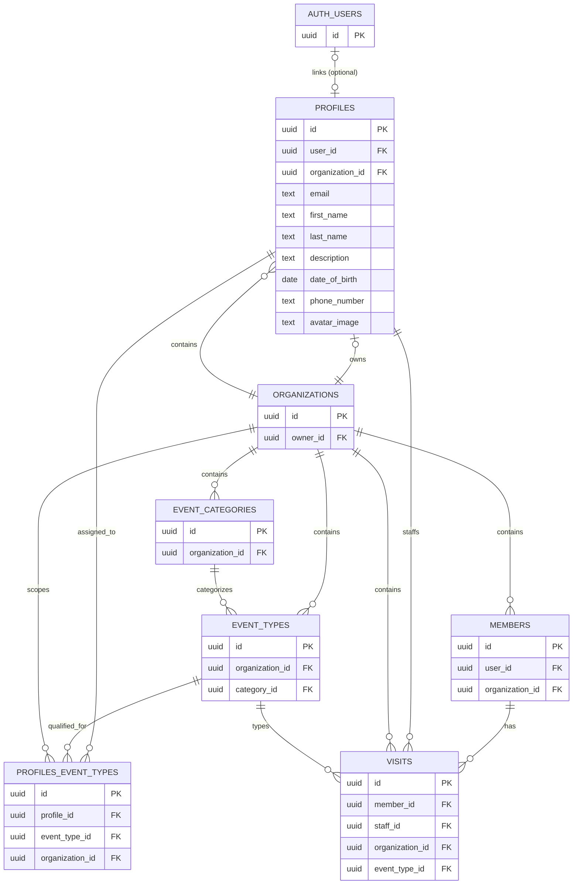

# Wellness Manage

A modern wellness management application built with Next.js, TypeScript, and Tailwind CSS.

## Table of Contents

- [Tech Stack](#tech-stack)
- [Project Structure](#project-structure)
- [Getting Started](#getting-started)
  - [Prerequisites](#prerequisites)
  - [Installation](#installation)
  - [Reset Local Database and Re-seed](#reset-local-database-and-re-seed)
- [Available Scripts](#available-scripts)
- [Features](#features)
- [Database Schema](#database-schema)
  - [Key Entities](#key-entities)
- [Development Guidelines](#development-guidelines)
  - [Import Aliases](#import-aliases)
  - [File Organization](#file-organization)
  - [Using shadcn/ui Components](#using-shadcnui-components)
  - [Authentication with Supabase](#authentication-with-supabase)
- [Deployment](#deployment)
  - [Deploy to Vercel](#deploy-to-vercel)
  - [Environment Variables for Production](#environment-variables-for-production)
  - [Post-Deployment](#post-deployment)
- [Learn More](#learn-more)
- [License](#license)
- [Consolidated Documentation](#consolidated-documentation)
  - [Permission System Documentation](#permission-system-documentation)
  - [Supabase Migration Guide - Member Management Integration](#supabase-migration-guide-member-management-integration)
  - [Test Accounts](#test-accounts)
  - [Permissions Summary](#permissions-summary)
  - [Database Seed Data](#database-seed-data)
  - [Types](#types)
  - [Library](#library)
  - [Hooks](#hooks)
  - [shadcn/ui Components](#shadcnui-components)
  - [Components](#components)
  - [Stripe Integration Setup Guide](#stripe-integration-setup-guide)
  - [Sentry Error Monitoring](#sentry-error-monitoring)
  - [Centralized Routes Configuration](#centralized-routes-configuration)
  - [EventType Permissions](#eventtype-permissions)
  - [EventType Feature](#eventtype-feature)
  - [Authentication Guide](#authentication-guide)
  - [API Performance Optimization](#api-performance-optimization)
  - [Event Types API](#event-types-api)
  - [Supabase Authentication Setup](#supabase-authentication-setup)
  - [shadcn/ui Setup Guide](#shadcnui-setup-guide)
  - [Quick Start Guide](#quick-start-guide)
  - [Project Structure Overview](#project-structure-overview)
  - [Prettier Setup](#prettier-setup)
  - [Deployment Guide - Vercel](#deployment-guide-vercel)
  - [Git Hooks](#git-hooks)

## Tech Stack

- **Framework:** Next.js 16 (App Router)
- **Language:** TypeScript 5
- **Styling:** Tailwind CSS 4
- **Components:** shadcn/ui
- **Icons:** Lucide React
- **Authentication:** Supabase Auth
- **Formatting:** Prettier (with import sorting)
- **Package Manager:** pnpm
- **Node.js:** v22 (LTS)

## Project Structure

```
wellness-manage/
├── src/
│   ├── app/              # Next.js App Router pages and API routes
│   ├── components/       # React components (ui/, settings/, dashboard/, …)
│   ├── hooks/            # Custom React hooks
│   ├── lib/              # Utilities, Supabase clients, validations, routes
│   └── types/            # TypeScript type definitions
├── supabase/
│   ├── migrations/       # Database migrations
│   ├── functions/        # Edge functions (e.g. notify)
│   └── config.toml       # Local Supabase config
├── scripts/              # deploy, seed, ship-staging
├── docs/                 # Focused guides (seeding, E2E, beta)
├── public/               # Static assets
├── AGENTS.md             # Quick reference for contributors
└── package.json
```

## Getting Started

### Prerequisites

- Node.js 22.x (LTS) - specified in `.nvmrc`
- pnpm 10.x or higher
- nvm (recommended for Node.js version management)
- Docker Desktop (required for local Supabase)
- Supabase CLI (`supabase`) installed globally, or use `pnpm dlx supabase`

### Installation

1. Clone the repository
2. Use the correct Node.js version:

```bash
nvm use
```

3. Install dependencies:

```bash
pnpm install
```

4. Start Supabase locally:

```bash
# Option A: if Supabase CLI is installed globally
supabase start

# Option B: without global install
pnpm dlx supabase start
```

5. Set up environment variables for local development:

Create a `.env.local` file in the root directory (copy from [`.env.example`](.env.example) and fill in values):

```bash
NEXT_PUBLIC_APP_URL=http://localhost:3000
NEXT_PUBLIC_API_URL=http://localhost:3000/api
NEXT_PUBLIC_APP_ENV=local
NEXT_PUBLIC_SUPABASE_URL=http://127.0.0.1:54321
NEXT_PUBLIC_SUPABASE_PUBLISHABLE_KEY=<anon-key-from-supabase-start-output>
SUPABASE_SECRET_KEY=<service-role-key-from-supabase-start-output>
```

Use the values printed by `supabase start` (especially API URL, anon key, and service_role key).

See [Supabase Authentication Setup](#supabase-authentication-setup) for full setup details.

Optional: stop local Supabase when done:

```bash
supabase stop
# or
pnpm dlx supabase stop
```

6. Run the development server:

```bash
pnpm dev
```

7. Open [http://localhost:3000](http://localhost:3000) in your browser

### Reset Local Database and Re-seed

If you need a clean local database with migrations and seed data re-applied:

```bash
# Reset database, re-run migrations, and apply seed data
supabase db reset

# Alternative without global Supabase CLI install
pnpm dlx supabase db reset
```

Use this when local schema/data gets out of sync during development.

For full demo data (clients, appointments, auth user), prefer:

```bash
pnpm db:seed
```

See [docs/database-seeding.md](docs/database-seeding.md).

## Available Scripts

- `pnpm dev` - Start development server
- `pnpm build` - Build for production
- `pnpm start` - Start production server
- `pnpm type-check` - Check TypeScript types
- `pnpm test` - Run unit tests (Vitest)
- `pnpm test:watch` - Run tests in watch mode
- `pnpm format` - Format code with Prettier
- `pnpm format:check` - Check formatting (CI-friendly)
- `pnpm supabase:start` / `pnpm supabase:stop` - Local Supabase (Docker)
- `pnpm supabase:db:reset` - Reset local DB and run migrations + `seed.sql`
- `pnpm supabase:db:push` - Push migrations to linked remote project
- `pnpm db:seed` - Seed demo data via `scripts/seed-db.ts` (see [docs/database-seeding.md](docs/database-seeding.md))
- `pnpm db:reset-and-seed` - Wipe remote/local data and re-seed
- `pnpm deploy` - Deploy Supabase edge functions + `db push` (manual)
- `pnpm ship:staging` - Push staging → PR → wait CI → merge to main → sync branches

See also [`AGENTS.md`](AGENTS.md) for the day-to-day command cheat sheet.

## Features

- ✅ Next.js 16 with App Router
- ✅ TypeScript for type safety
- ✅ Tailwind CSS for styling
- ✅ shadcn/ui components (Button, Card, Badge, Input, Label)
- ✅ Lucide React icons
- ✅ Supabase authentication (email/password)
- ✅ Protected routes with middleware
- ✅ Login page and dashboard
- ✅ Prettier + Husky pre-commit formatting
- ✅ Custom hooks (useLocalStorage, useUser, useTrialGuard)
- ✅ Utility functions
- ✅ API routes ready
- ✅ Path aliases (@/_ for src/_)
- ✅ Node.js version pinned with .nvmrc

## Database Schema

The application uses Supabase (PostgreSQL) with the following entity relationships:



### Key Entities

- **AUTH_USERS**: Supabase authentication (optional - profiles can exist without auth)
- **PROFILES**: Organizational users (owners, staff) with personal information - can exist without auth account
- **ORGANIZATIONS**: Wellness center organizations (owned by a profile)
- **MEMBERS**: Clients/customers of the wellness center (no auth account required)
- **EVENT_CATEGORIES**: Service categories (e.g., Massage, Yoga, Therapy)
- **EVENT_TYPES**: Specific services/treatments offered
- **PROFILES_EVENT_TYPES**: Junction table linking profiles to services they can perform (many-to-many)
- **VISITS**: Appointments/visits scheduled for members

## Development Guidelines

### Import Aliases

Use the `@/` alias to import from the src directory:

```typescript
import { User } from "@/types";

import { formatDate } from "@/lib/utils";
```

### File Organization

- **Components:** Place reusable UI components in `src/components/`
  - `src/components/ui/` - shadcn/ui components
- **Hooks:** Custom React hooks go in `src/hooks/`
- **Utils:** Helper functions in `src/lib/`
- **Types:** TypeScript types in `src/types/`
- **API Routes:** Backend endpoints in `src/app/api/`

### Using shadcn/ui Components

shadcn/ui components are installed in `src/components/ui/`. To add more components:

```bash
npx shadcn@latest add [component-name]
```

Example usage:

```typescript
import { Button } from "@/components/ui/button";
import { Card } from "@/components/ui/card";

export default function MyComponent() {
  return (
    <Card>
      <Button>Click me</Button>
    </Card>
  );
}
```

Available components:

- Button
- Card (with CardHeader, CardTitle, CardDescription, CardContent, CardFooter)
- Badge
- Input
- Label

Browse all components: [shadcn/ui](https://ui.shadcn.com/docs/components)

### Authentication with Supabase

The project uses Supabase for authentication. See [Supabase Authentication Setup](#supabase-authentication-setup) for complete setup instructions.

**Quick Start:**

1. Create a Supabase project
2. Add credentials to `.env.local`
3. Create a test user in Supabase dashboard
4. Visit `/login` to sign in
5. Access `/dashboard` after authentication

**Protected Routes:**

- `/dashboard` - Requires authentication
- Middleware automatically redirects unauthenticated users to `/login`

**Sign Out:**

- Click "Sign Out" button on dashboard
- Or POST to `/api/auth/signout`

## Deployment

### Deploy to Vercel

The easiest way to deploy this Next.js app is using Vercel:

[](https://vercel.com/new/clone?repository-url=https://github.com/proginmind/wellness-manage)

**Quick Steps:**

1. Click the deploy button above or go to [vercel.com/new](https://vercel.com/new)
2. Import your GitHub repository
3. Add environment variables (see `.env.example`)
4. Click "Deploy"
5. Update Supabase redirect URLs with your Vercel domain

**Detailed Instructions:** See [Deployment Guide - Vercel](#deployment-guide-vercel) for complete deployment guide.

### Environment Variables for Production

Ensure these are set in Vercel (see [`.env.example`](.env.example) for the full list):

```bash
NEXT_PUBLIC_SUPABASE_URL=your_production_supabase_url
NEXT_PUBLIC_SUPABASE_PUBLISHABLE_KEY=your_production_publishable_key
SUPABASE_SECRET_KEY=your_production_secret_key
NEXT_PUBLIC_APP_URL=https://your-app.vercel.app
NEXT_PUBLIC_APP_ENV=production
```

### Post-Deployment

After deploying, update your Supabase project settings:

- Add Vercel URL to **Site URL**
- Add `https://your-app.vercel.app/**` to **Redirect URLs**

## Learn More

- [Next.js Documentation](https://nextjs.org/docs)
- [TypeScript Documentation](https://www.typescriptlang.org/docs)
- [Tailwind CSS Documentation](https://tailwindcss.com/docs)
- [Vercel Deployment Docs](https://vercel.com/docs)
- [Supabase Documentation](https://supabase.com/docs)

## License

MIT

---

## Consolidated Documentation

This README includes long-form reference sections below. For day-to-day work, prefer **[`AGENTS.md`](AGENTS.md)** and **[`docs/PROJECT_STATE.md`](docs/PROJECT_STATE.md)**. Route definitions live in **`src/lib/routes.ts`** (source of truth).

---

### Permission System Documentation

#### Overview

This application uses a **Granular Resource-Action** permission system (Option B) that provides fine-grained control over who can do what.

#### Architecture

```
┌─────────────────────────────────────────┐
│         Permission Layers               │
├─────────────────────────────────────────┤
│ 1. Database (RLS)     ✅ Enforced       │
│ 2. API Routes         ✅ Implemented    │
│ 3. UI Components      ✅ Implemented    │
└─────────────────────────────────────────┘
```

#### Core Concepts

##### Resources

- `members` - Wellness center members
- `visits` - Appointments / visits
- `organization` - Organization settings
- `staff` - Staff profiles and team management
- `event_types` - Services (event types)
- `event_categories` - Service categories
- `billing` - Subscription and billing
- `plans` - Subscription plans
- `profile` - Signed-in user’s own profile

##### Actions

- `view` - Read access
- `create` - Create new items
- `update` - Modify existing items
- `delete` - Permanent deletion
- `archive` - Soft deletion / cancel
- `export` - Data export
- `remove` - Remove access (e.g. staff from org)
- `manage` - Full management (reserved for resources that use it)

##### Permission Format

Permissions are expressed as `resource.action`:

- `members.delete` - Delete members
- `staff.remove` - Remove a staff member from the organization
- `organization.update` - Update organization

#### Permission Matrix

| Resource             | Owner | Staff |
| -------------------- | ----- | ----- |
| **Members**          |
| view                 | ✅    | ✅    |
| create               | ✅    | ✅    |
| update               | ✅    | ✅    |
| archive              | ✅    | ✅    |
| delete               | ✅    | ❌    |
| export               | ✅    | ✅    |
| **Visits**           |
| view                 | ✅    | ✅    |
| create               | ✅    | ✅    |
| update               | ✅    | ✅    |
| archive              | ✅    | ✅    |
| delete               | ✅    | ❌    |
| **Organization**     |
| view                 | ✅    | ✅    |
| update               | ✅    | ❌    |
| delete               | ✅    | ❌    |
| **Staff**            |
| view                 | ✅    | ✅    |
| update               | ✅    | ❌    |
| remove               | ✅    | ❌    |
| **Event types**      |
| view                 | ✅    | ✅    |
| create               | ✅    | ❌    |
| update               | ✅    | ❌    |
| delete               | ✅    | ❌    |
| **Event categories** |
| view                 | ✅    | ✅    |
| create               | ✅    | ❌    |
| update               | ✅    | ❌    |
| delete               | ✅    | ❌    |
| **Billing**          |
| view                 | ✅    | ❌    |
| **Plans**            |
| view                 | ✅    | ❌    |
| **Profile**          |
| view                 | ✅    | ✅    |
| update               | ✅    | ✅    |

#### Usage

##### 1. Server-Side (API Routes)

```typescript
import { requirePermission } from "@/lib/api-permissions";

export async function DELETE(request: Request) {
  // Check permission before processing
  const result = await requirePermission("members", "delete");
  if (result instanceof NextResponse) return result;

  const { role, organizationId } = result;
  // ... proceed with delete
}
```

**Other API helpers:**

```typescript
requireOwner(); // Require owner role
requireAuth(); // Require any authenticated user
checkPermission(); // Non-throwing permission check
```

##### 2. Client-Side (React Components)

###### Using Hooks

```typescript
import { usePermissions, useMemberPermissions } from "@/hooks/usePermissions";

function MyComponent() {
  const { can, isOwner } = usePermissions();
  const { canDelete, canArchive } = useMemberPermissions();

  return (
    <>
      {can('members', 'create') && <AddButton />}
      {canDelete && <DeleteButton />}
      {isOwner && <OwnerPanel />}
    </>
  );
}
```

###### Using Permission Gate

```typescript
import { PermissionGate, OwnerGate } from "@/components/PermissionGate";

function MyComponent() {
  return (
    <>
      <PermissionGate resource="staff" action="remove">
        <RemoveStaffButton />
      </PermissionGate>

      <OwnerGate fallback={<p>Owner only</p>}>
        <SettingsPanel />
      </OwnerGate>
    </>
  );
}
```

##### 3. Utility Functions

```typescript
import { assertPermission, can, hasPermission } from "@/lib/permissions";

// Check permission
if (can("owner", "members", "delete")) {
  // ...
}

// Check with string format
if (hasPermission("owner", "staff.remove")) {
  // ...
}

// Throw error if denied
assertPermission("owner", "members", "delete");
// throws: PermissionError if denied
```

#### Available Hooks

##### usePermissions()

Main hook with all permission checking functions.

```typescript
const {
  user, // Current user
  role, // User's role
  isOwner, // Is owner?
  isStaff, // Is staff?
  can, // Check permission
  hasPermission, // Check by string
  canAny, // Any of actions?
  canAll, // All actions?
} = usePermissions();
```

##### useMemberPermissions()

Member-specific permissions.

```typescript
const { canView, canCreate, canUpdate, canDelete, canArchive, canExport } = useMemberPermissions();
```

##### useStaffPermissions()

Staff management permissions.

```typescript
const { canViewStaff, canRemoveStaff } = useStaffPermissions();
```

##### useOrganizationPermissions()

Organization management permissions.

```typescript
const { canView, canUpdate, canDelete } = useOrganizationPermissions();
```

#### Security Layers

##### ✅ Layer 1: Database (RLS)

PostgreSQL Row Level Security enforces organization isolation and permission checks at the database level.

- **Cannot be bypassed** by application code
- Prevents cross-organization data leaks
- Enforces owner-only deletes

##### ✅ Layer 2: API Routes

Permission middleware checks before processing requests.

- Validates user authentication
- Checks role permissions
- Returns 403 if denied

##### ✅ Layer 3: UI Components

Hide/show UI elements based on permissions.

- Improves UX (don't show unusable buttons)
- Not a security layer (can be bypassed)
- Always backed by Layer 1 & 2

#### Adding New Permissions

##### 1. Update Permission Definition

```typescript
// src/lib/permissions.ts

export const PERMISSIONS = {
  owner: {
    reports: ["view", "create", "export"], // ← Add here
  },
  staff: {
    reports: ["view"], // ← Add here
  },
};
```

##### 2. Add API Middleware

```typescript
// src/app/api/reports/route.ts

export async function GET() {
  const result = await requirePermission("reports", "view");
  if (result instanceof NextResponse) return result;
  // ...
}
```

##### 3. Update UI

```typescript
// src/components/ReportsPage.tsx

const { can } = usePermissions();

return (
  <>
    {can('reports', 'export') && <ExportButton />}
  </>
);
```

#### Best Practices

1. **Always check at API level** - Never trust client-side checks alone
2. **Use RLS for data isolation** - Database enforces organization boundaries
3. **Hide UI for better UX** - Don't show buttons users can't use
4. **Use permission gates** - Cleaner than conditional rendering
5. **Check early** - Fail fast with permission checks
6. **Test both roles** - Verify owner and staff experiences

#### Examples

##### Example 1: Delete Button (Owner Only)

```typescript
// API Route
export async function DELETE(request: Request) {
  const result = await requirePermission('members', 'delete');
  if (result instanceof NextResponse) return result;
  // ✅ Only owners reach here
}

// UI Component
function DeleteButton() {
  const { canDelete } = useMemberPermissions();

  if (!canDelete) return null; // ❌ Staff won't see this

  return <Button variant="destructive">Delete</Button>;
}
```

##### Example 2: Owner-only staff removal (UI gate)

```typescript
// UI with Gate
<PermissionGate resource="staff" action="remove">
  <Button variant="destructive" onClick={handleRemoveStaff}>
    Remove from organization
  </Button>
</PermissionGate>

// API Route — use requirePermission with the same resource/action
export async function DELETE(request: Request) {
  const result = await requirePermission("staff", "remove");
  if (result instanceof NextResponse) return result;
  // ...
}
```

##### Example 3: Conditional Features

```typescript
function Dashboard() {
  const { isOwner } = usePermissions();
  const { canExport } = useMemberPermissions();

  return (
    <>
      <h1>Dashboard</h1>

      {/* Everyone sees this */}
      <MemberList />

      {/* Only if can export */}
      {canExport && <ExportButton />}

      {/* Owner-only panel */}
      {isOwner && <BillingPanel />}
    </>
  );
}
```

#### Troubleshooting

##### Permission Denied in API

- Check user has profile in database
- Verify role is set correctly
- Check PERMISSIONS matrix in `permissions.ts`

##### UI shows button but API blocks

- This is correct behavior (defense in depth)
- Fix by hiding button: `{can('resource', 'action') && <Button />}`

##### Staff can access owner features

- Check RLS policies in database
- Verify API route uses `requirePermission()`
- Check UI uses permission gates

#### Files Reference

- `src/lib/permissions.ts` - Core permission system
- `src/lib/api-permissions.ts` - API middleware
- `src/hooks/usePermissions.ts` - React hooks
- `src/components/PermissionGate.tsx` - Gate components
- `supabase/migrations/003_*.sql` - RLS policies

---

### Supabase Migration Guide - Member Management Integration

This guide walks you through setting up Supabase database for the Wellness Center member management system.

---

#### Prerequisites

- Supabase project already created
- Supabase credentials in `.env.local`:
  ```
  NEXT_PUBLIC_SUPABASE_URL=https://your-project.supabase.co
  NEXT_PUBLIC_SUPABASE_PUBLISHABLE_KEY=your-publishable-key
  SUPABASE_SECRET_KEY=your-secret-key
  ```

---

#### Step 1: Run Database Migrations

##### Option A: Using Supabase Dashboard (Recommended)

1. **Go to Supabase Dashboard**
   - Navigate to your project
   - Click on "SQL Editor" in the left sidebar

2. **Run Members Table Migration**
   - Click "New Query"
   - Copy contents from `supabase/migrations/001_create_members_table.sql`
   - Paste into SQL Editor
   - Click "Run" (or press Cmd/Ctrl + Enter)
   - ✅ You should see: "Success. No rows returned"

3. **Create Storage Bucket (Dashboard UI)**
   - Click "Storage" in the left sidebar
   - Click "New bucket" button
   - Enter bucket name: **member-images**
   - Set as **Public bucket** (toggle ON)
   - Click "Create bucket"
   - ✅ You should see the new bucket in the list

4. **Configure Bucket Settings**
   - Click on the `member-images` bucket
   - Click the settings gear icon
   - Set **File size limit**: 5 MB (5242880 bytes)
   - Set **Allowed MIME types**:
     ```
     image/jpeg
     image/jpg
     image/png
     image/webp
     ```
   - Click "Save"

5. **Run Storage Policies Migration**
   - Go back to "SQL Editor"
   - Click "New Query"
   - Copy contents from `supabase/migrations/002_create_storage_bucket.sql`
   - Paste into SQL Editor
   - Click "Run"
   - ✅ You should see: "Success. No rows returned"

##### Option B: Using Supabase CLI

```bash
# Install Supabase CLI (if not installed)
npm install -g supabase

# Login to Supabase
supabase login

# Link to your project
supabase link --project-ref your-project-ref

# Run migrations
supabase db push
```

---

#### Step 2: Verify Database Setup

##### Check Members Table

Go to "Table Editor" in Supabase Dashboard:

- ✅ You should see a new table called `members`
- ✅ Click on it to see the columns:
  - id, user_id, first_name, last_name, email, image, date_of_birth
  - date_joined, status, archived_at, created_at, updated_at

##### Check RLS Policies

Go to "Authentication" → "Policies":

- ✅ You should see 4 policies for `members` table:
  - "Authenticated users can read members"
  - "Authenticated users can create members"
  - "Authenticated users can update members"
  - "Authenticated users can delete members"

##### Check Indexes

Run this query in SQL Editor to verify indexes:

```sql
SELECT indexname, indexdef
FROM pg_indexes
WHERE tablename = 'members';
```

✅ You should see 5 indexes:

- idx_members_status
- idx_members_email
- idx_members_date_joined
- idx_members_user_id
- idx_members_search

---

#### Step 3: Verify Storage Setup

##### Check Storage Bucket

1. **Go to Storage in Dashboard**
   - Click "Storage" in left sidebar
   - ✅ You should see bucket: `member-images`

2. **Check Bucket Configuration**
   - Click on `member-images` bucket
   - Click "Settings" (gear icon)
   - ✅ Verify settings:
     - Public bucket: **Yes**
     - File size limit: **5 MB**
     - Allowed MIME types: **image/jpeg, image/jpg, image/png, image/webp**

3. **Check Storage Policies**
   - In Storage section, click "Policies"
   - ✅ You should see 4 policies for `member-images`:
     - "Authenticated users can upload member images"
     - "Public read access to member images"
     - "Authenticated users can update member images"
     - "Authenticated users can delete member images"

---

#### Step 4: (Optional) Seed Test Data

If you want to populate with test data from mock data:

```sql
-- Insert test members (replace user_id with your actual user ID)
INSERT INTO public.members (
  user_id, first_name, last_name, email, date_of_birth, date_joined, status
) VALUES
  ('your-user-id', 'Emma', 'Johnson', 'emma.johnson@example.com', '1992-05-20', '2024-01-15', 'active'),
  ('your-user-id', 'Michael', 'Chen', 'michael.chen@example.com', '1988-11-08', '2024-02-03', 'active'),
  ('your-user-id', 'Sarah', 'Williams', 'sarah.williams@example.com', '1995-07-14', '2024-03-12', 'active');

-- Verify insertion
SELECT * FROM public.members;
```

**Note:** Replace `'your-user-id'` with your actual authenticated user ID. You can get it by:

1. Log into your app
2. Run in browser console:
   ```javascript
   const { data } = await supabase.auth.getUser();
   console.log(data.user.id);
   ```

---

#### Step 5: Test Database Connection

Run this query in SQL Editor to test everything:

```sql
-- Test members table
SELECT
  COUNT(*) as total_members,
  COUNT(*) FILTER (WHERE status = 'active') as active_members,
  COUNT(*) FILTER (WHERE status = 'archived') as archived_members
FROM public.members;

-- Test indexes exist
SELECT schemaname, tablename, indexname
FROM pg_indexes
WHERE tablename = 'members';

-- Test RLS is enabled
SELECT tablename, rowsecurity
FROM pg_tables
WHERE tablename = 'members';
```

✅ Expected results:

- Row security should be: `true`
- All indexes should be listed
- Counts should match your data (0 if no seed data)

---

#### Step 6: Update Environment Variables (if needed)

Make sure your `.env.local` has all required variables:

```bash
# Supabase
NEXT_PUBLIC_SUPABASE_URL=https://your-project.supabase.co
NEXT_PUBLIC_SUPABASE_PUBLISHABLE_KEY=your-publishable-key-here

# Secret key for admin operations (keep this secret!)
SUPABASE_SECRET_KEY=your-secret-key-here
```

**Security Note:** Never commit `.env.local` to git!

---

#### Step 4: Organization Setup

##### Important: Multi-Tenant Architecture

The application now uses an **organization-based multi-tenant architecture**. Each user belongs to an organization, and all data (members, visits, and related records) is scoped to that organization.

##### Create Your Organization

**Option A: Manual Creation (Recommended)**

1. **Go to "SQL Editor"** in Supabase Dashboard.
2. **Click "New Query"**.
3. **Run the following SQL** (replace `YOUR_EMAIL` with your actual email):

```sql
-- Create organization and profile for your user
DO $$
DECLARE
  v_user_id uuid;
  v_org_id uuid;
BEGIN
  -- Get your user ID
  SELECT id INTO v_user_id FROM auth.users WHERE email = 'YOUR_EMAIL';

  IF v_user_id IS NULL THEN
    RAISE EXCEPTION 'User not found. Please sign up first.';
  END IF;

  -- Create organization
  INSERT INTO public.organizations (name, owner_id)
  VALUES ('My Wellness Center', v_user_id)
  RETURNING id INTO v_org_id;

  -- Create profile (owner role)
  INSERT INTO public.profiles (user_id, organization_id, role)
  VALUES (v_user_id, v_org_id, 'owner');

  RAISE NOTICE 'Organization created successfully!';
END $$;
```

4. **Update `organization_id` for existing members** (if any):

```sql
-- Update existing members to belong to your organization
UPDATE public.members
SET organization_id = (SELECT id FROM public.organizations WHERE owner_id = (SELECT id FROM auth.users WHERE email = 'YOUR_EMAIL'))
WHERE organization_id IS NULL;

-- Make organization_id required
ALTER TABLE public.members ALTER COLUMN organization_id SET NOT NULL;
```

**Option B: Use Seed Script (Creates organization + fake members)**

1. **Go to "SQL Editor"**.
2. **Copy and paste the contents of `supabase/seed-with-org.sql`**.
3. **Click "Run"**.

This will create:

- ✅ An organization named "Wellness Center"
- ✅ A profile for your user (owner role)
- ✅ 10 fake members

#### Step 5: Seed Database (Optional - Old Script)

If you want to populate your database with 10 fake members for testing:

1. **Go to "SQL Editor"** in Supabase Dashboard.
2. **Click "New Query"**.
3. **Copy and paste the contents of `supabase/seed.sql`** into the editor.
4. **Click "Run"**.
5. **Verification:** You should see the count and list of inserted members.

The seed script automatically associates all members with your first authenticated user.

#### Troubleshooting

##### Issue: "relation 'members' already exists"

**Solution:** Table already created. Check "Table Editor" to verify structure.

##### Issue: "permission denied for table members"

**Solution:**

1. Check RLS policies are created
2. Verify user is authenticated
3. Run: `GRANT ALL ON public.members TO authenticated;`

##### Issue: "bucket 'member-images' already exists"

**Solution:** Bucket already created. Check Storage section to verify.

##### Issue: Cannot upload images

**Solution:**

1. Check bucket exists and is public
2. Verify storage policies are created
3. Check file size < 5MB
4. Check MIME type is allowed

---

#### Next Steps

After completing this setup, proceed to:

1. ✅ **Integration Phase:** Update API routes to use Supabase
2. ✅ **Testing Phase:** Test all CRUD operations
3. ✅ **Migration Phase:** Migrate image uploads to Supabase Storage

---

#### Verification Checklist

Before proceeding to integration:

- [ ] ✅ Members table created with all columns
- [ ] ✅ RLS policies enabled and created (4 policies)
- [ ] ✅ Indexes created (5 indexes)
- [ ] ✅ Timestamp trigger working
- [ ] ✅ Storage bucket created (`member-images`)
- [ ] ✅ Storage policies created (4 policies)
- [ ] ✅ Environment variables set correctly
- [ ] ✅ Test query runs successfully

---

#### Support

If you encounter issues:

1. Check Supabase Dashboard logs (Settings → API → Logs)
2. Verify RLS policies match authenticated user
3. Check browser console for errors
4. Review Supabase documentation: https://supabase.com/docs

---

**Ready to integrate? Proceed to the API integration phase!**

---

### Test Accounts

> **Full seeding guide:** see [docs/database-seeding.md](docs/database-seeding.md) for local and production setup, including one test user on production.

This document describes test data and accounts for development and testing.

#### Quick Start (Works Everywhere!)

The seed script now works without requiring auth users to exist first!

##### Setup Steps

1. **Reset and seed** (recommended):

   ```bash
   pnpm db:reset-and-seed    # remote or local (wipes auth + data, then seeds)
   ```

   Local alternative:

   ```bash
   pnpm supabase:db:reset    # migrations only
   pnpm db:seed              # full demo data + auth user
   ```

   Configure `.env.local` with `NEXT_PUBLIC_SUPABASE_URL`, `SUPABASE_SERVICE_ROLE_KEY`, and optionally `SEED_OWNER_EMAIL` / `SEED_OWNER_PASSWORD`. See [docs/database-seeding.md](docs/database-seeding.md).

2. **Create auth users** (only if `SEED_CREATE_AUTH_USERS=false`):

   **Option A: Use the helper script (recommended for local):**

   ```bash
   ./scripts/create-test-users.sh
   ```

   Creates all test users with password `password123` and auto-links them to profiles.

   **Option B: Sign up manually at your app** with one of these emails:
   - `owner@example.com` - Becomes the organization owner
   - `staff1@example.com` - Alice Johnson (Massage Therapist)
   - `staff2@example.com` - Bob Martinez (Yoga Instructor)
   - `staff3@example.com` - Carol Lee (Wellness Consultant)
   - `staff4@example.com` - David Chen (Massage & Yoga)

3. **That's it!** Your auth accounts automatically link to the pre-created profiles!

#### How Auth Linking Works

1. The seed script creates profiles **without** `user_id`
2. It creates auth users via the Admin API and sets `profiles.user_id`
3. Your role and organization are already configured on the profile

_Note: The old `handle_new_user` database trigger was removed; use `pnpm db:seed` to create and link auth users._

#### Test Accounts

| Email                | Role  | Name          | Password (via script) |
| -------------------- | ----- | ------------- | --------------------- |
| `owner@example.com`  | Owner | John Smith    | `password123`         |
| `staff1@example.com` | Staff | Alice Johnson | `password123`         |
| `staff2@example.com` | Staff | Bob Martinez  | `password123`         |
| `staff3@example.com` | Staff | Carol Lee     | `password123`         |
| `staff4@example.com` | Staff | David Chen    | `password123`         |

_Note: If you sign up manually instead of using the script, you can choose any password._

#### Seeded Sample Data

After running the seed script:

- 🏢 **Organization:** "Wellness Center Demo"
- 👤 **1 Owner profile:** owner@example.com (John Smith)
- 👨‍💼 **4 Staff profiles** (with event types and availability):
  - staff1@example.com (Alice Johnson - Massage: Swedish, Deep Tissue)
  - staff2@example.com (Bob Martinez - Vinyasa Yoga)
  - staff3@example.com (Carol Lee - Wellness Consultation)
  - staff4@example.com (David Chen - Swedish, Yoga, Wellness)
- 👥 **10 Client Members:** Emma Johnson, Liam Smith, Olivia Brown, etc.
- 📋 **3 Event Categories:** Massage Therapy, Yoga & Fitness, Wellness Consultation
- 🎯 **4 Event Types:** Swedish Massage, Deep Tissue, Vinyasa Yoga, Wellness Consultation

#### Testing Different Roles

##### Owner Access

1. Sign up with `owner@example.com`
2. Full access to:
   - Dashboard and analytics
   - Team management (invite, edit roles)
   - All settings
   - Create/edit/archive all resources

##### Staff Access

1. Sign up with `staff1@example.com` through `staff4@example.com`
2. Limited access:
   - View dashboard
   - View team members (read-only)
   - Create/view/edit visits
   - View members and event types
   - Cannot: manage team, change settings

#### Running the Seed Script

```bash
# Local: Complete reset + create auth users
pnpx supabase db reset
./scripts/create-test-users.sh

# Remote: Push migrations and seed
supabase db push
supabase db seed
# (then create users via UI or script)

# Just run seed (after migrations already applied)
supabase db seed
```

#### Benefits of This Approach

✅ **No manual user creation** - Just run seed and sign up  
✅ **Works on remote databases** - No permission issues  
✅ **Predictable roles** - Sign up with specific email = specific role  
✅ **Easy testing** - Create/delete auth accounts without touching profiles  
✅ **Flexible** - Profiles can exist before anyone logs in

#### Security Note

⚠️ **These are test accounts for local development only!**

- Never use these emails in production
- Change the seed script emails before deploying
- Add staff accounts through your chosen operational process for production users

---

### Permissions Summary

#### Role-Based Access Control (RBAC)

This application uses a granular permission system based on roles, resources, and actions.

#### Roles

- **Owner** - Organization owner with full administrative access
- **Staff** - Regular staff member with limited permissions

#### Resources & Permissions

##### Members

| Action  | Owner | Staff |
| ------- | ----- | ----- |
| View    | ✅    | ✅    |
| Create  | ✅    | ✅    |
| Update  | ✅    | ✅    |
| Delete  | ✅    | ❌    |
| Archive | ✅    | ✅    |
| Export  | ✅    | ✅    |

##### Organization

| Action | Owner | Staff |
| ------ | ----- | ----- |
| View   | ✅    | ✅    |
| Update | ✅    | ❌    |
| Delete | ✅    | ❌    |

##### Staff Management

| Action | Owner | Staff |
| ------ | ----- | ----- |
| View   | ✅    | ✅    |
| Update | ✅    | ❌    |
| Remove | ✅    | ❌    |

##### Event Types (Services)

| Action | Owner | Staff |
| ------ | ----- | ----- |
| View   | ✅    | ✅    |
| Create | ✅    | ❌    |
| Update | ✅    | ❌    |
| Delete | ✅    | ❌    |

**Note:** Staff can view event types (needed for creating bookings), but only owners can create/modify service configurations.

##### Profile (Own)

| Action | Owner | Staff |
| ------ | ----- | ----- |
| View   | ✅    | ✅    |
| Update | ✅    | ✅    |

#### Usage Examples

##### In React Components (Client-side)

```typescript
import { usePermissions } from "@/hooks/usePermissions";

function EventTypesList() {
  const { can } = usePermissions();

  return (
    <div>
      {can("event_types", "create") && (
        <Button onClick={handleCreate}>Create Event Type</Button>
      )}
    </div>
  );
}
```

##### In API Routes (Server-side)

```typescript
import { requirePermission } from "@/lib/api-permissions";

export async function POST(request: Request) {
  const result = await requirePermission("event_types", "create");
  if (result instanceof NextResponse) return result;

  const { role, organizationId } = result;
  // ... proceed with creation
}
```

##### Direct Permission Check

```typescript
import { can } from "@/lib/permissions";

if (can(userRole, "event_types", "delete")) {
  // User can delete event types
}
```

#### Permission Helper Functions

Available in `src/lib/permissions.ts`:

- `can(role, resource, action)` - Check single permission
- `canAny(role, resource, actions[])` - Check if any action is allowed
- `canAll(role, resource, actions[])` - Check if all actions are allowed
- `hasPermission(role, permission)` - Check using permission string (e.g., "event_types.create")
- `getPermissions(role)` - Get all permissions for a role
- `getActions(role, resource)` - Get allowed actions for a resource
- `isOwner(role)` - Check if user is owner
- `isStaff(role)` - Check if user is staff
- `assertPermission(role, resource, action)` - Throw error if not permitted

#### Adding New Permissions

To add a new resource:

1. Add to `Resource` type in `src/lib/permissions.ts`
2. Add permissions to `PERMISSIONS` object for each role
3. Add descriptions to `PERMISSION_DESCRIPTIONS`
4. Add N/A combinations for unused action/resource pairs
5. Update this documentation

#### Security Notes

- ✅ RLS (Row Level Security) enforced at database level
- ✅ API routes protected with `requirePermission()`
- ✅ UI components use `usePermissions()` hook
- ✅ Type-safe permission strings prevent typos
- ✅ Single source of truth in `PERMISSIONS` constant

---

### Database Seed Data

This directory contains SQL files for seeding the database with sample data.

#### Event Types Seed Data

The `event_types.sql` file contains 10 wellness center service types that can be used for testing and as templates for new organizations.

##### Included Event Types

1. **Swedish Massage - 60 min** ($85)
   - Category: massage
   - Duration: 60 min
   - Relaxing full-body massage

2. **Deep Tissue Massage - 90 min** ($125)
   - Category: massage
   - Duration: 90 min
   - Intensive therapeutic massage

3. **Initial Wellness Consultation** ($75)
   - Category: consultation
   - Duration: 45 min
   - Requires approval

4. **Follow-up Consultation** ($50)
   - Category: consultation
   - Duration: 30 min

5. **Private Yoga Session** ($70)
   - Category: fitness
   - Duration: 60 min

6. **Acupuncture Treatment** ($95)
   - Category: therapy
   - Duration: 60 min

7. **Guided Meditation Session** ($45)
   - Category: mindfulness
   - Duration: 45 min

8. **Nutritional Counseling** ($90)
   - Category: consultation
   - Duration: 60 min
   - Requires approval

9. **Physical Therapy Session** ($110)
   - Category: therapy
   - Duration: 60 min
   - Requires approval

10. **Aromatherapy Spa Treatment** ($105)
    - Category: spa
    - Duration: 75 min

#### How to Use

##### Option 1: Manual Seeding for Specific Organization

Replace `YOUR_ORGANIZATION_ID` in the SQL file with your actual organization UUID, then run:

```sql
-- Run the INSERT statements from event_types.sql
```

##### Option 2: Use Helper Function for Single Organization

```sql
-- Seed default event types for a specific organization
SELECT seed_default_event_types_for_organization('your-org-uuid-here');
```

##### Option 3: Seed All Organizations

```sql
-- Seed event types for all existing organizations
DO $$
DECLARE
  org_record RECORD;
BEGIN
  FOR org_record IN SELECT id FROM public.organizations LOOP
    PERFORM seed_default_event_types_for_organization(org_record.id);
  END LOOP;
END $$;
```

##### Option 4: Seed Only Organizations Without Event Types

```sql
-- Seed only for organizations that don't have any event types yet
DO $$
DECLARE
  org_record RECORD;
BEGIN
  FOR org_record IN
    SELECT o.id
    FROM public.organizations o
    LEFT JOIN public.event_types et ON et.organization_id = o.id
    WHERE et.id IS NULL
    GROUP BY o.id
  LOOP
    PERFORM seed_default_event_types_for_organization(org_record.id);
  END LOOP;
END $$;
```

#### Using with Supabase CLI

If using Supabase CLI, you can run the seed file:

```bash
# Run seed file directly
supabase db reset

# Or run specific seed file
psql $DATABASE_URL -f supabase/seeds/event_types.sql
```

#### Verification

After seeding, verify the data was inserted correctly:

```sql
SELECT
  name,
  category,
  duration,
  price,
  is_active,
  is_bookable
FROM public.event_types
ORDER BY category, price;
```

#### Customization

Feel free to modify the seed data to match your wellness center's services:

- Adjust prices based on your market
- Change durations to match your service offerings
- Modify categories to fit your business model
- Update colors to match your brand
- Adjust booking requirements (approval, advance notice, etc.)

#### Notes

- All event types are set to `is_active = true` and `is_bookable = true` by default
- Buffer times are included for preparation and cleanup
- Default currency is USD (modify as needed)
- Minimum advance booking hours vary by service type
- Some services require manual approval (consultations, therapy sessions)

---

### Types

This directory contains TypeScript type definitions and interfaces.

#### Structure

- `index.ts` - Global type definitions shared across the application
- Create specific type files for domains (e.g., `user.ts`, `api.ts`)

#### Usage

```typescript
import type { ApiResponse, User } from "@/types";
```

#### Guidelines

- Prefer interfaces over types for object shapes
- Use type aliases for unions and complex types
- Export all types for reusability

---

### Library

This directory contains utility functions, helpers, and shared logic.

#### Files

- `utils.ts` - General utility functions
- `constants.ts` - Application constants and configuration values

#### Usage

```typescript
import { APP_NAME } from "@/lib/constants";
import { formatDate } from "@/lib/utils";
```

---

### Hooks

This directory contains custom React hooks.

#### Files

- `useLocalStorage.ts` - Hook for managing localStorage with React state

#### Usage

```typescript
"use client";

import { useLocalStorage } from "@/hooks/useLocalStorage";

function MyComponent() {
  const [value, setValue] = useLocalStorage("key", "defaultValue");
  // ...
}
```

#### Guidelines

- All hooks must follow the "use" naming convention
- Mark client-side hooks with 'use client' directive
- Include TypeScript types for better DX

---

### shadcn/ui Components

This directory contains shadcn/ui components installed via the CLI.

#### Installed Components

- **Button** - Versatile button component with multiple variants
- **Card** - Container component with header, content, and footer sections
- **Badge** - Small status indicators and labels
- **Input** - Form input component
- **Label** - Form label component

#### Adding New Components

To add more shadcn/ui components:

```bash
npx shadcn@latest add [component-name]
```

Examples:

```bash
npx shadcn@latest add dialog
npx shadcn@latest add dropdown-menu
npx shadcn@latest add select
npx shadcn@latest add tabs
```

#### Usage

Import components from `@/components/ui/[component-name]`:

```typescript
import { Badge } from "@/components/ui/badge";
import { Button } from "@/components/ui/button";
import { Card, CardContent, CardHeader, CardTitle } from "@/components/ui/card";
import { Input } from "@/components/ui/input";
import { Label } from "@/components/ui/label";
```

#### Documentation

Full component documentation: https://ui.shadcn.com/docs/components

#### Customization

These components are fully customizable. You can:

- Modify the component files directly in this directory
- Adjust colors via CSS variables in `src/app/globals.css`
- Change the default styles in `tailwind.config.ts`

---

### Components

This directory contains reusable React components.

#### Structure

- Place shared components directly in this folder
- For complex components with multiple files, create a subfolder
- Export components from index files for cleaner imports

#### Example

```tsx
// Usage in other files
import { Header } from "@/components/Header";

// components/Header/index.tsx
export { Header } from "./Header";
```

---

### Stripe Integration Setup Guide

This guide walks you through setting up Stripe for subscription plans in the wellness-manage app.

#### Prerequisites

- A [Stripe account](https://dashboard.stripe.com/register)
- Node.js 18+ (already in project)

---

#### Step 1: Install Stripe SDK

From the project root:

```bash
pnpm add stripe
```

---

#### Step 2: Get Your Stripe API Keys

1. Go to [Stripe Dashboard](https://dashboard.stripe.com) → **Developers** → **API keys**
2. Copy your keys:
   - **Publishable key** (starts with `pk_test_` or `pk_live_`) – safe for client-side
   - **Secret key** (starts with `sk_test_` or `sk_live_`) – **server-side only, never expose**

---

#### Step 3: Add Environment Variables

Add to your `.env.local` (create from `.env.example` if needed):

```env
# Stripe (add these to .env.local)
STRIPE_SECRET_KEY=sk_test_your_secret_key_here
NEXT_PUBLIC_STRIPE_PUBLISHABLE_KEY=pk_test_your_publishable_key_here
```

**Important:** Use `sk_test_` and `pk_test_` for development. Switch to `sk_live_` and `pk_live_` for production.

---

#### Step 4: Create Products and Prices in Stripe

##### Option A: Stripe Dashboard (recommended for initial setup)

1. Go to [Stripe Dashboard](https://dashboard.stripe.com) → **Products** → **Add product**
2. Create your first plan, e.g. **Lifetime**:
   - **Name:** Lifetime
   - **Description:** One-time payment for lifetime access. No recurring fees, no limits.
   - **Pricing:** One-time, $50 USD
   - **Marketing feature list:** Click "+ Add line" and add each feature, e.g.:
     - Member management
     - Team management
     - Visit and booking management
     - Event types and categories
     - Staff availability scheduling
     - Organization settings
     - Manual staff management
     - Dashboard and analytics

3. Add more products as needed (e.g., Monthly Pro, Annual Pro).

##### Option B: Stripe CLI (for automation)

```bash
# Install Stripe CLI: https://stripe.com/docs/stripe-cli
stripe products create \
  --name="Lifetime" \
  --description="One-time payment for lifetime access" \
  -d "metadata[features]=[\"Member management\",\"Team management\"]"

stripe prices create \
  --product=prod_xxx \
  --unit-amount=5000 \
  --currency=usd
```

---

#### Step 5: Features for Plans

Use the **Marketing feature list** for each product (Stripe's intended field for pricing tables). Add each feature with "+ Add line".

**Fallback:** If you use `metadata.features` instead, it must be a JSON array string, e.g.  
`["Member management","Team management",...]`

---

#### Step 6: Verify the Integration

1. Ensure `STRIPE_SECRET_KEY` is set in `.env.local`
2. Run the app: `pnpm dev`
3. Visit `/settings/plans` (as owner)
4. You should see plans fetched from Stripe

---

#### Architecture Overview

```
┌─────────────────────────────────────────────────────────────┐
│  Stripe Dashboard                                            │
│  • Products (name, description, marketing_features)           │
│  • Prices (amount, currency, recurring/one_time)             │
└─────────────────────────────────────────────────────────────┘
                              │
                              │ Stripe API
                              ▼
┌─────────────────────────────────────────────────────────────┐
│  getPlans() in src/lib/plans.ts                              │
│  • Fetches active products with expanded prices               │
│  • Maps to Plan type (id, title, price, features)           │
└─────────────────────────────────────────────────────────────┘
                              │
                              ▼
┌─────────────────────────────────────────────────────────────┐
│  /settings/plans page                                        │
│  • Server component calls getPlans()                         │
│  • Renders PlansListContainer with fetched plans             │
└─────────────────────────────────────────────────────────────┘
```

#### Fallback Behavior

When `STRIPE_SECRET_KEY` is not set:

- **Development:** `getPlans()` returns mock data so the app works without Stripe
- **Production:** Consider failing or returning empty if Stripe is required

---

#### Next Steps (Checkout Flow)

To implement checkout:

1. Create checkout session API route: `POST /api/checkout`
2. Use `stripe.checkout.sessions.create()` with `price_id` and `success_url`/`cancel_url`
3. Add webhook: `POST /api/webhooks/stripe` for `checkout.session.completed`, `customer.subscription.*`
4. Store subscription in DB (webhook payload)

See [Stripe Checkout docs](https://docs.stripe.com/checkout) for details.

---

### Sentry Error Monitoring

#### Overview

Sentry is integrated for error monitoring, performance tracing, and user context across all runtime environments: browser, Node.js server, Edge middleware, and Supabase Edge Functions.

- **Project**: `wellness-manage` on org `proginmind`
- **Dashboard**: https://proginmind.sentry.io/projects/wellness-manage/

---

#### Architecture

##### Next.js (3 runtimes)

| File                                     | Runtime | Purpose                                       |
| ---------------------------------------- | ------- | --------------------------------------------- |
| `src/instrumentation-client.ts`          | Browser | Client-side error + performance tracking      |
| `sentry.server.config.ts`                | Node.js | API routes, server components                 |
| `sentry.edge.config.ts`                  | Edge    | Middleware (`src/lib/supabase/middleware.ts`) |
| `src/instrumentation.ts`                 | —       | Registers server + edge configs with Next.js  |
| `src/app/global-error.tsx`               | Browser | Top-level React error boundary                |
| `src/components/sentry-user-context.tsx` | Browser | Attaches user/org context to every event      |

##### Supabase Edge Functions

`supabase/functions/notify/index.ts` uses the Sentry Deno SDK.
Each request is wrapped in `Sentry.withScope()` to prevent context leaking between concurrent requests.

---

#### Environments

Errors are tagged by environment so staging and production are clearly separated in the Sentry UI.

| Where              | Variable                                    | Value                    |
| ------------------ | ------------------------------------------- | ------------------------ |
| Local dev          | `NEXT_PUBLIC_APP_ENV` in `.env.local`       | `local`                  |
| Staging Vercel     | `NEXT_PUBLIC_APP_ENV` in Vercel env vars    | `staging`                |
| Production Vercel  | `NEXT_PUBLIC_APP_ENV` in Vercel env vars    | `production`             |
| Supabase functions | `APP_ENV` secret via `supabase secrets set` | `staging` / `production` |

Filter by environment in Sentry: **Issues → Environment dropdown**.

---

#### User Context

`SentryUserContext` (rendered in root layout) calls `Sentry.setUser()` on every authenticated session:

```ts
{
  id: user.id,
  email: user.email,
  organizationId: user.organization?.id,
  organizationName: user.organization?.name,
}
```

This appears under **"User"** on every Sentry issue — useful for identifying which org is affected.

---

#### Source Maps

Source maps are uploaded automatically on every build via `withSentryConfig` in `next.config.ts`.

**Required environment variable** (set in Vercel project settings):

```
SENTRY_AUTH_TOKEN=sntrys_eyJ...
```

Get a token from: **Sentry → Settings → Auth Tokens → Create New Token**
Required scopes: `project:releases`, `org:read`

---

#### Sample Rates

| Environment              | `tracesSampleRate` |
| ------------------------ | ------------------ |
| `local` / `development`  | `1.0` (100%)       |
| `staging` / `production` | `0.1` (10%)        |

Adjust in `src/instrumentation-client.ts`, `sentry.server.config.ts`, `sentry.edge.config.ts`.

---

#### Supabase Edge Function Secrets

Set per project via Supabase CLI:

```bash
pnpx supabase secrets set \
  SENTRY_DSN=https://417f...@sentry.io/... \
  APP_ENV=staging \
  --project-ref <your-project-ref>
```

For local function development, create `supabase/functions/.env` (git-ignored):

```bash
RESEND_API_KEY=re_...
SENTRY_DSN=https://417f...@sentry.io/...
APP_ENV=local
```

---

#### Ad Blocker Bypass

Sentry browser requests are tunnelled through the app's own domain via `tunnelRoute: "/monitoring"` in `next.config.ts`. This prevents ad blockers from silently dropping error reports.

---

#### Alert Rules

Configure in **Sentry → Alerts**. Recommended setup:

- Alert on new issues in `production` environment only
- Ignore `local` and `staging` to avoid noise

---

### Centralized Routes Configuration

This document explains how routes are managed in the application using a centralized configuration file.

#### Overview

All application routes (both UI pages and API endpoints) are defined in `/src/lib/routes.ts`. This provides:

- **Single Source of Truth**: All routes in one place
- **Type Safety**: TypeScript autocomplete and validation
- **Easy Refactoring**: Change a route once, update everywhere
- **Consistency**: No hardcoded strings scattered across the codebase
- **Better Developer Experience**: IDE autocomplete for all routes
- **Uniform API**: All routes are functions for consistency

#### File Structure

The routes configuration is organized into two main sections:

1. **Page Route Builders (`buildRoute`)** - All UI page routes as functions
2. **API Route Builders (`buildApiRoute`)** - All API endpoint routes as functions

**Important**: All routes are functions for consistency. Static routes (like `/login`) are zero-parameter functions, while dynamic routes (like `/members/:id`) accept parameters.

#### Usage Examples

##### Static Page Routes

```typescript
import { buildRoute } from "@/lib/routes";
import Link from "next/link";
import { redirect } from "next/navigation";

// In components
<Link href={buildRoute.dashboard()}>Dashboard</Link>
<Link href={buildRoute.membersNew()}>Add Client</Link>

// In Server Components
if (!user) {
  redirect(buildRoute.login());
}
```

##### Dynamic Page Routes

```typescript
import { buildRoute } from "@/lib/routes";
import Link from "next/link";

// Link to member detail page
<Link href={buildRoute.member(memberId)}>View Member</Link>

// Link to visit edit page
<Link href={buildRoute.visitEdit(visitId)}>Edit Visit</Link>
```

##### Static API Routes

```typescript
import useSWR from "swr";

import { fetcher } from "@/lib/fetcher";
import { buildApiRoute } from "@/lib/routes";

// Fetch from API
const { data } = useSWR(buildApiRoute.members(), fetcher);

// Post to API
await fetch(buildApiRoute.authSignout(), { method: "POST" });
```

##### Dynamic API Routes

```typescript
import { buildApiRoute } from "@/lib/routes";

// Fetch specific member
const response = await fetch(buildApiRoute.member(memberId));

// Fetch member visit history
const response = await fetch(buildApiRoute.memberVisits(memberId));
```

##### Route Utilities

```typescript
import { buildRoute, isRouteActive } from "@/lib/routes";

// Check if current path is under a route
const isSettingsActive = isRouteActive("/settings", pathname);

// Usage in component
<Link
  href={buildRoute.settingsProfile()}
  className={isRouteActive("/settings", pathname) ? "active" : ""}
>
  Settings
</Link>
```

#### Available Routes

> Canonical list: `src/lib/routes.ts`. All routes are **functions** — always call them, e.g. `buildRoute.dashboard()`.

##### Page Routes

| Function                            | Path                     | Description           |
| ----------------------------------- | ------------------------ | --------------------- |
| `buildRoute.home()`                 | `/`                      | Landing page          |
| `buildRoute.login()`                | `/login`                 | Login page            |
| `buildRoute.forgotPassword()`       | `/forgot-password`       | Forgot password       |
| `buildRoute.resetPassword()`        | `/reset-password`        | Reset password        |
| `buildRoute.dashboard()`            | `/dashboard`             | Dashboard             |
| `buildRoute.team()`                 | `/team`                  | Staff list            |
| `buildRoute.teamNew()`              | `/team/new`              | Add staff profile     |
| `buildRoute.members()`              | `/members`               | Clients list          |
| `buildRoute.membersNew()`           | `/members/new`           | Add client            |
| `buildRoute.visits()`               | `/visits`                | Appointments list     |
| `buildRoute.visitsNew()`            | `/visits/new`            | Book appointment      |
| `buildRoute.eventTypes()`           | `/event-types`           | Services list         |
| `buildRoute.eventCategories()`      | `/event-categories`      | Categories list       |
| `buildRoute.settingsProfile()`      | `/settings/profile`      | Profile settings      |
| `buildRoute.settingsOrganization()` | `/settings/organization` | Organization settings |
| `buildRoute.settingsPlans()`        | `/settings/plans`        | Plans / trial         |
| `buildRoute.settingsBilling()`      | `/settings/billing`      | Billing               |

##### Dynamic Page Route Builders

| Function                    | Parameters   | Example                                              |
| --------------------------- | ------------ | ---------------------------------------------------- |
| `buildRoute.member(id)`     | `id: string` | `buildRoute.member("123")` → `/members/123`          |
| `buildRoute.memberEdit(id)` | `id: string` | `buildRoute.memberEdit("123")` → `/members/123/edit` |
| `buildRoute.visit(id)`      | `id: string` | `buildRoute.visit("456")` → `/visits/456`            |
| `buildRoute.visitEdit(id)`  | `id: string` | `buildRoute.visitEdit("456")` → `/visits/456/edit`   |
| `buildRoute.teamMember(id)` | `id: string` | `buildRoute.teamMember("789")` → `/team/789`         |

##### API Routes

| Function                            | Path                       | Description         |
| ----------------------------------- | -------------------------- | ------------------- |
| `buildApiRoute.authMe()`            | `/api/auth/me`             | Current user + org  |
| `buildApiRoute.authSignout()`       | `/api/auth/signout`        | Sign out            |
| `buildApiRoute.members()`           | `/api/members`             | Clients CRUD        |
| `buildApiRoute.visits()`            | `/api/visits`              | Appointments CRUD   |
| `buildApiRoute.eventTypes()`        | `/api/event-types`         | Services CRUD       |
| `buildApiRoute.eventCategories()`   | `/api/event-categories`    | Categories CRUD     |
| `buildApiRoute.profiles()`          | `/api/profiles`            | Staff profiles      |
| `buildApiRoute.stats()`             | `/api/stats`               | Dashboard stats     |
| `buildApiRoute.billing()`           | `/api/billing`             | Billing info        |
| `buildApiRoute.checkout()`          | `/api/checkout`            | Stripe checkout     |
| `buildApiRoute.health()`            | `/api/health`              | Health check        |
| `buildApiRoute.uploadMemberImage()` | `/api/upload/member-image` | Client photo upload |

##### Dynamic API Route Builders

| Function                                | Parameters   | Example                          |
| --------------------------------------- | ------------ | -------------------------------- |
| `buildApiRoute.member(id)`              | `id: string` | `/api/members/123`               |
| `buildApiRoute.memberVisits(id)`        | `id: string` | `/api/members/123/visits`        |
| `buildApiRoute.visit(id)`               | `id: string` | `/api/visits/456`                |
| `buildApiRoute.profile(id)`             | `id: string` | `/api/profiles/789`              |
| `buildApiRoute.profileVisits(id)`       | `id: string` | `/api/profiles/789/visits`       |
| `buildApiRoute.profileAvailability(id)` | `id: string` | `/api/profiles/789/availability` |

#### Adding New Routes

All routes are functions for consistency. Add static routes as zero-parameter functions, and dynamic routes with parameters.

##### 1. Add Static Page Route

```typescript
// In src/lib/routes.ts - buildRoute section

export const buildRoute = {
  // ... existing routes
  newFeature: () => "/new-feature" as const,
} as const;
```

##### 2. Add Dynamic Page Route

```typescript
// In src/lib/routes.ts - buildRoute section

export const buildRoute = {
  // ... existing routes
  newFeature: (id: string) => `/new-feature/${id}` as const,
} as const;
```

##### 3. Add Static API Route

```typescript
// In src/lib/routes.ts - buildApiRoute section

export const buildApiRoute = {
  // ... existing routes
  newFeatureApi: () => "/api/new-feature" as const,
} as const;
```

##### 4. Add Dynamic API Route

```typescript
// In src/lib/routes.ts - buildApiRoute section

export const buildApiRoute = {
  // ... existing routes
  newFeatureApi: (id: string) => `/api/new-feature/${id}` as const,
} as const;
```

#### Migration Guide

If you have existing hardcoded routes, here's how to migrate them:

##### Before (Hardcoded)

```typescript
// ❌ Don't do this
<Link href="/dashboard">Dashboard</Link>
<Link href={`/members/${id}`}>Member</Link>
const response = await fetch("/api/members");
router.push("/login");
```

##### After (Function-Based)

```typescript
// ✅ Do this instead
import { buildApiRoute, buildRoute } from "@/lib/routes";

// Always call functions with ()
<Link href={buildRoute.dashboard()}>Dashboard</Link>
<Link href={buildRoute.member(id)}>Member</Link>
const response = await fetch(buildApiRoute.members());
router.push(buildRoute.login());
```

**Important**: All routes are functions now, even static ones. Always call with `()` for static routes.

#### Benefits

##### 1. Consistency

All routes use the same pattern - they're all functions. This makes the API more predictable and easier to learn.

```typescript
// Everything follows the same pattern
buildRoute.dashboard(); // static route - no params
buildRoute.member(id); // dynamic route - with params
buildApiRoute.members(); // static API - no params
buildApiRoute.member(id); // dynamic API - with params
```

##### 2. Easy Refactoring

If you need to change `/members` to `/team-members`, you only need to update one place:

```typescript
export const buildRoute = {
  members: () => "/team-members" as const, // Changed here only
};
```

All links and references automatically update.

##### 3. Type Safety

TypeScript will catch typos and invalid routes:

```typescript
// ✅ TypeScript happy
<Link href={buildRoute.dashboard()}>Dashboard</Link>

// ❌ TypeScript error - property doesn't exist
<Link href={buildRoute.dashbord()}>Dashboard</Link>

// ❌ TypeScript error - missing required parameter
<Link href={buildRoute.member()}>Member</Link>
```

##### 4. Autocomplete

Your IDE will show you all available routes:

```typescript
import { buildRoute } from "@/lib/routes";

buildRoute. // IDE shows: dashboard(), members(), member(id), etc.
```

##### 5. Find All Usages

You can easily find where a route is used by searching for the function:

```
buildRoute.members  // Find all references to the members route
```

#### Best Practices

1. **Always import from `@/lib/routes`** - Never hardcode route strings
2. **Always call functions** - Even for static routes, use `buildRoute.dashboard()` not `buildRoute.dashboard`
3. **Use camelCase naming** - Follow JavaScript conventions (`membersNew`, not `MEMBERS_NEW`)
4. **Keep routes organized** - Group related routes together
5. **Document new routes** - Add comments for complex routes
6. **Use descriptive names** - Make it clear what each route does

#### Common Patterns

##### Search Parameters

```typescript
// For routes with search params, use template strings
const url = `${buildApiRoute.members()}?search=${query}`;
```

##### Form Actions

```typescript
// Use buildApiRoute for form actions - call functions with ()
<form action={buildApiRoute.authSignout()} method="post">
  <Button type="submit">Sign Out</Button>
</form>
```

##### Conditional Redirects

```typescript
// Check user state and redirect appropriately - call functions with ()
if (!user) {
  redirect(buildRoute.login());
} else if (!user.profile) {
  redirect(buildRoute.settingsProfile());
} else {
  redirect(buildRoute.dashboard());
}
```

##### Active Route Highlighting

```typescript
import { usePathname } from "next/navigation";
import { buildRoute, isRouteActive } from "@/lib/routes";

const pathname = usePathname();
const isActive = isRouteActive("/settings", pathname);

<Link
  href={buildRoute.settingsProfile()}
  className={isActive ? "active" : ""}
>
  Settings
</Link>
```

#### Related Documentation

- [Project Structure](#project-structure-overview)
- [API Documentation](#api-performance-optimization)
- [TypeScript Best Practices](../README.md#development)

---

### EventType Permissions

#### Overview

EventType management is primarily **owner-controlled**, but staff have read-only access to view available services when creating bookings.

#### Permission Matrix

| Action | Owner | Staff | Reason                                               |
| ------ | ----- | ----- | ---------------------------------------------------- |
| View   | ✅    | ✅    | All users need to see available services for booking |
| Create | ✅    | ❌    | Only owners can define new services                  |
| Update | ✅    | ❌    | Only owners can modify pricing/settings              |
| Delete | ✅    | ❌    | Only owners can remove services                      |

#### Rationale

##### Why Owner-Only for Management?

1. **Business Control** - Service pricing and offerings are strategic business decisions
2. **Consistency** - Centralized control prevents conflicting service definitions
3. **Compliance** - Pricing changes should be authorized at the highest level
4. **Revenue Protection** - Prevents accidental price changes or service removal
5. **Professional Standards** - Maintains service quality standards

##### Why Staff Can View?

Staff need read access to event types because they:

- ✅ **Create bookings/visits** for members and need to select services
- ✅ **View service details** (duration, price) when scheduling
- ✅ **See available options** to properly assist members
- ✅ **Understand scheduling** (duration + buffers) for calendar planning

##### What Staff CAN Do

- ✅ **View all event types** in their organization
- ✅ **See service details** (name, duration, price, description)
- ✅ **Select event types** when creating bookings
- ✅ **Read scheduling info** (duration, buffers)

##### What Staff CANNOT Do

- ❌ **Create new services** - Owner only
- ❌ **Modify pricing** - Owner only
- ❌ **Change service settings** - Owner only
- ❌ **Delete services** - Owner only

#### Implementation

##### Database Level (RLS Policies)

```sql
-- Users can view event types in their organization
CREATE POLICY "Users can view event types in their organization"
  ON public.event_types FOR SELECT
  TO authenticated
  USING (
    organization_id IN (
      SELECT organization_id
      FROM public.profiles
      WHERE id = auth.uid()
    )
  );

-- Only owners can delete event types
CREATE POLICY "Owners can delete event types in their organization"
  ON public.event_types FOR DELETE
  TO authenticated
  USING (
    organization_id IN (
      SELECT o.id
      FROM public.organizations o
      INNER JOIN public.profiles p ON p.user_id = o.owner_id
      WHERE p.id = auth.uid()
    )
  );
```

##### Application Level

**Permission Definition** (`src/lib/permissions.ts`):

```typescript
export const PERMISSIONS = {
  owner: {
    event_types: ["view", "create", "update", "delete"] as Action[],
  },
  staff: {
    event_types: ["view"] as Action[], // Read-only access
  },
};
```

##### Usage Examples

###### API Route Protection

```typescript
// src/app/api/event-types/route.ts
import { requirePermission } from "@/lib/api-permissions";

export async function POST(request: Request) {
  // This will return 403 for staff users
  const result = await requirePermission("event_types", "create");
  if (result instanceof NextResponse) return result;

  const { organizationId } = result;
  // ... create event type
}
```

###### UI Component

```typescript
// src/components/event-types/event-type-list.tsx
import { usePermissions } from "@/hooks/usePermissions";

export function EventTypeList() {
  const { can } = usePermissions();

  return (
    <div>
      {/* Both owners and staff can view */}
      <EventTypeGrid eventTypes={eventTypes} />

      {/* Only owners will see management buttons */}
      {can("event_types", "create") && (
        <Button>Create Event Type</Button>
      )}

      {can("event_types", "update") && (
        <Button>Edit</Button>
      )}
    </div>
  );
}
```

###### Direct Check

```typescript
import { can } from "@/lib/permissions";

// Check if user can modify event types
if (can(userRole, "event_types", "update")) {
  // Show edit form
} else {
  // Show read-only view
}
```

#### Future Considerations

##### Option 1: Add Staff View Permission

If staff need to view event types (e.g., for reporting or planning):

```typescript
staff: {
  event_types: ["view"] as Action[], // Read-only access
}
```

##### Option 2: Add Manager Role

For larger organizations, consider a "manager" role:

```typescript
export type UserRole = "owner" | "manager" | "staff";

export const PERMISSIONS = {
  manager: {
    event_types: ["view", "create", "update"] as Action[], // No delete
  },
};
```

##### Option 3: Granular Permissions

For complex scenarios, consider splitting permissions:

```typescript
export type Resource =
  | "event_types.pricing" // Only owner
  | "event_types.scheduling" // Owner + manager
  | "event_types.details"; // Owner + manager
```

#### Testing Permissions

##### Owner User

```typescript
const ownerRole = "owner";
console.log(can(ownerRole, "event_types", "view")); // true
console.log(can(ownerRole, "event_types", "create")); // true
console.log(can(ownerRole, "event_types", "update")); // true
console.log(can(ownerRole, "event_types", "delete")); // true
```

##### Staff User

```typescript
const staffRole = "staff";
console.log(can(staffRole, "event_types", "view")); // true ✅
console.log(can(staffRole, "event_types", "create")); // false
console.log(can(staffRole, "event_types", "update")); // false
console.log(can(staffRole, "event_types", "delete")); // false
```

#### Error Handling

When a staff user tries to modify event types:

**API Response (for create/update/delete):**

```json
{
  "error": "Forbidden",
  "message": "You don't have permission to create event_types"
}
```

**HTTP Status:** `403 Forbidden`

**Note:** Staff will NOT get errors when viewing event types (they have read permission).

#### Next Steps

1. ✅ Permissions configured (DONE)
2. 📝 Create API routes with permission checks
3. 🎨 Build UI with role-based rendering
4. 🧪 Add integration tests for permission enforcement
5. 📚 Update user documentation

#### Related Files

- `src/lib/permissions.ts` - Permission definitions
- `src/lib/api-permissions.ts` - API middleware
- `src/hooks/usePermissions.ts` - React hook
- `supabase/migrations/009_create_event_types_table.sql` - RLS policies

---

### EventType Feature

#### Overview

EventTypes are service templates that define the configuration for bookable services (similar to Calendly's event types). Each EventType represents a specific service offering with its own duration, price, and booking rules.

#### Permissions

EventType management is primarily an **owner-controlled** feature:

**Owner:**

- ✅ View event types
- ✅ Create new event types
- ✅ Update event types
- ✅ Delete event types

**Staff:**

- ✅ View event types (read-only)
- ❌ Create, update, or delete event types

Staff need read access to view available services when creating bookings/visits for members.

#### Files Created

##### 1. Database Migration

**`supabase/migrations/009_create_event_types_table.sql`**

- Creates `event_types` table with all necessary columns
- Includes indexes for performance
- RLS policies for multi-tenant security
- Automatic timestamp updates

##### 2. TypeScript Interface

**`src/types/event-type.ts`**

- `EventType` interface matching the database schema
- Exported from `src/types/index.ts` for easy imports

##### 3. Zod Validation Schemas

**`src/lib/validations/event-type.ts`**

- `eventTypeFormSchema` - For creating event types
- `eventTypeUpdateSchema` - For partial updates
- Includes validation rules and error messages

#### Database Schema

```sql
event_types (
  id                        UUID PRIMARY KEY
  organization_id           UUID (references organizations)
  name                      TEXT
  description               TEXT
  color                     TEXT (hex color, default: #3b82f6)
  category                  TEXT
  duration                  INTEGER (minutes)
  buffer_before             INTEGER (minutes, default: 0)
  buffer_after              INTEGER (minutes, default: 0)
  price                     DECIMAL(10,2)
  currency                  TEXT (default: USD)
  is_active                 BOOLEAN (default: true)
  is_bookable               BOOLEAN (default: true)
  requires_approval         BOOLEAN (default: false)
  max_advance_booking_days  INTEGER (nullable)
  min_advance_booking_hours INTEGER (default: 24)
  created_at                TIMESTAMPTZ
  updated_at                TIMESTAMPTZ
)
```

#### TypeScript Usage

##### Import

```typescript
import { EventType } from "@/types/event-type";
import { eventTypeFormSchema, EventTypeFormValues } from "@/lib/validations/event-type";
```

##### Example EventType Object

```typescript
const massageService: EventType = {
  id: "uuid",
  organizationId: "org-uuid",
  name: "60-Minute Swedish Massage",
  description: "Relaxing full-body massage with aromatherapy oils",
  color: "#10b981",
  category: "massage",
  duration: 60,
  bufferBefore: 10, // 10 min setup time
  bufferAfter: 10, // 10 min cleanup time
  price: 89.99,
  currency: "USD",
  isActive: true,
  isBookable: true,
  requiresApproval: false,
  maxAdvanceBookingDays: 90,
  minAdvanceBookingHours: 24,
  createdAt: new Date(),
  updatedAt: new Date(),
};
```

##### Form Validation Example

```typescript
import { zodResolver } from "@hookform/resolvers/zod";
import { useForm } from "react-hook-form";

import { eventTypeFormSchema } from "@/lib/validations/event-type";

const form = useForm({
  resolver: zodResolver(eventTypeFormSchema),
  defaultValues: {
    name: "",
    description: "",
    color: "#3b82f6",
    category: "",
    duration: 60,
    bufferBefore: 0,
    bufferAfter: 0,
    price: 0,
    currency: "USD",
    isActive: true,
    isBookable: true,
    requiresApproval: false,
    minAdvanceBookingHours: 24,
  },
});
```

#### Example Use Cases

##### 1. Massage Therapy

```typescript
{
  name: "Deep Tissue Massage",
  duration: 90,
  price: 120.00,
  category: "massage",
  bufferBefore: 15,
  bufferAfter: 15,
  requiresApproval: false
}
```

##### 2. Consultation (Free)

```typescript
{
  name: "Free 15-Min Consultation",
  duration: 15,
  price: 0.00,
  category: "consultation",
  requiresApproval: true, // manual approval
  maxAdvanceBookingDays: 30
}
```

##### 3. Premium Service

```typescript
{
  name: "VIP Wellness Package",
  duration: 120,
  price: 299.99,
  category: "package",
  bufferBefore: 30,
  bufferAfter: 30,
  requiresApproval: true,
  minAdvanceBookingHours: 48 // 2 days notice
}
```

#### Field Explanations

##### Scheduling Fields

- **duration**: Main service time in minutes
- **bufferBefore**: Setup/prep time before the service
- **bufferAfter**: Cleanup/transition time after the service

Example: 60-min massage with 10-min buffers = 80 total minutes blocked on calendar

##### Booking Control

- **isActive**: Service is available (can be temporarily disabled)
- **isBookable**: Customers can book online (vs. staff-only booking)
- **requiresApproval**: Bookings need manual approval before confirmation

##### Advance Booking Limits

- **maxAdvanceBookingDays**: How far ahead customers can book (e.g., 90 days)
- **minAdvanceBookingHours**: Minimum notice required (e.g., 24 hours)

##### Visual Organization

- **color**: Hex color code for calendar display
- **category**: Group similar services (massage, consultation, therapy)

#### Next Steps

To complete the booking system, you'll need:

1. **Add `event_type_id` to Visits table**
   - Reference to EventType
   - Snapshot fields for historical data

2. **Create EventType CRUD operations**
   - `getEventTypes()`
   - `createEventType()`
   - `updateEventType()`
   - `deleteEventType()`

3. **Create EventType management UI**
   - List view with all event types
   - Form for creating/editing
   - Color picker for calendar display

4. **Update Visit creation**
   - Select from available EventTypes
   - Pre-fill duration, price from EventType
   - Calculate total time including buffers

#### Migration

To apply the database changes:

```bash
# If using Supabase CLI
supabase migration up

# Or manually apply the SQL file to your database
```

#### Benefits of This Approach

✅ **Reusability** - Create service once, use many times
✅ **Consistency** - Same service always has same duration/price
✅ **Flexibility** - Easy to add new services without code changes
✅ **Analytics** - Track bookings per service type
✅ **Pricing History** - Change prices without affecting past bookings
✅ **Calendar Display** - Color-coded services for easy viewing

---

### Authentication Guide

This document explains how authentication is handled in the application using a centralized approach.

#### Overview

Authentication is handled in two layers:

1. **Middleware** - Route-level protection (redirects unauthenticated users)
2. **Server Utilities** - Functions to get user data when needed

This eliminates the need for repetitive auth checks in every page/component.

#### Architecture

##### Layer 1: Middleware (Route Protection)

The middleware (`src/lib/supabase/middleware.ts`) automatically:

- ✅ Protects all routes under `/dashboard`, `/members`, `/visits`, `/settings`
- ✅ Redirects unauthenticated users to `/login`
- ✅ Redirects authenticated users away from auth pages (`/login`, `/forgot-password`, etc.)
- ✅ Runs on every request before pages load

**You don't need to add auth checks in pages under protected routes!**

##### Layer 2: Server Utilities (User Data)

The auth utilities (`src/lib/auth.ts`) provide functions to get user data:

- `requireAuth()` - Get user or redirect to login
- `getUser()` - Get user or null (no redirect)
- `isAuth()` - Check if authenticated (boolean)
- `requireAuthOr(path)` - Get user or redirect to custom path

#### Usage Examples

##### Pages That Don't Need User Data

If middleware protects the route and you don't need the user object, **you don't need any auth code**:

```typescript
// src/app/members/page.tsx
import { AppLayout } from "@/components/app-layout";
import { MembersListContainer } from "@/components/members-list-container";

export default async function MembersPage() {
  // That's it! Middleware handles auth protection
  return (
    <AppLayout>
      <MembersListContainer />
    </AppLayout>
  );
}
```

##### Pages That Need User Data

If you need the user object (to display name, email, etc.), use `requireAuth()`:

```typescript
// src/app/dashboard/page.tsx
import { requireAuth } from "@/lib/auth";
import { AppLayout } from "@/components/app-layout";

export default async function DashboardPage() {
  // Get the authenticated user (middleware already ensured auth)
  const user = await requireAuth();

  return (
    <AppLayout>
      <h1>Welcome back, {user.email}!</h1>
    </AppLayout>
  );
}
```

##### Pages That Work for Both Auth/Unauth Users

For pages that show different content based on auth state, use `getUser()`:

```typescript
// src/app/page.tsx (landing page)
import { getUser } from "@/lib/auth";
import { buildRoute } from "@/lib/routes";
import Link from "next/link";

export default async function HomePage() {
  const user = await getUser();

  return (
    <div>
      {user ? (
        <Link href={buildRoute.dashboard()}>Go to Dashboard</Link>
      ) : (
        <Link href={buildRoute.login()}>Sign In</Link>
      )}
    </div>
  );
}
```

##### Custom Redirect Path

If you need to redirect to a specific page instead of login:

```typescript
import { requireAuthOr } from "@/lib/auth";
import { buildRoute } from "@/lib/routes";

export default async function SpecialPage() {
  // Redirect to home page if not authenticated
  const user = await requireAuthOr(buildRoute.home());

  return <div>Special content</div>;
}
```

##### Boolean Auth Check

When you only need to know if user is authenticated (not the user object):

```typescript
import { isAuth } from "@/lib/auth";

export default async function NavBar() {
  const authenticated = await isAuth();

  return (
    <nav>
      {authenticated ? <ProfileButton /> : <SignInButton />}
    </nav>
  );
}
```

#### Adding New Protected Routes

To protect a new route, simply add it to the middleware:

```typescript
// src/lib/supabase/middleware.ts

const protectedRoutes = [
  "/dashboard",
  "/members",
  "/visits",
  "/settings",
  "/new-route", // Add your new route here
];
```

That's it! All pages under `/new-route/*` are now protected.

#### Client-Side Auth (Components)

For client components that need auth checks, use the existing `AuthGate` component:

```typescript
"use client";

import { AuthGate } from "@/components/PermissionGate";

export function MyClientComponent() {
  return (
    <AuthGate fallback={<p>Please sign in</p>}>
      <div>Protected content</div>
    </AuthGate>
  );
}
```

Or use the `usePermissions` hook:

```typescript
"use client";

import { usePermissions } from "@/hooks/usePermissions";

export function MyClientComponent() {
  const { isAuthenticated, isLoading } = usePermissions();

  if (isLoading) return <Loader />;
  if (!isAuthenticated) return <p>Please sign in</p>;

  return <div>Protected content</div>;
}
```

#### Migration Guide

##### Before (Repetitive)

```typescript
// ❌ Old way - repetitive in every page
import { redirect } from "next/navigation";

import { createClient } from "@/lib/supabase/server";

export default async function MembersPage() {
  const supabase = await createClient();
  const {
    data: { user },
  } = await supabase.auth.getUser();

  if (!user) {
    redirect("/login");
  }

  // ... rest of page
}
```

##### After (Clean)

```typescript
// ✅ Or if you need user data:
import { requireAuth } from "@/lib/auth";

// ✅ New way - no auth code needed!
export default async function MembersPage() {
  // Middleware handles auth protection
  // ... rest of page
}

export default async function DashboardPage() {
  const user = await requireAuth();
  // ... rest of page
}
```

#### Benefits

✅ **No Repetition** - Auth protection in one place (middleware)  
✅ **Cleaner Code** - Pages focus on their logic, not auth  
✅ **Type Safe** - All utilities return typed User objects  
✅ **Centralized** - Easy to update auth logic across the app  
✅ **Performance** - Middleware runs once per request  
✅ **Flexible** - Multiple utilities for different use cases

#### Available Auth Utilities

| Function              | Returns        | Redirects | Use Case                          |
| --------------------- | -------------- | --------- | --------------------------------- |
| `requireAuth()`       | `User`         | Yes       | Pages that require authentication |
| `getUser()`           | `User \| null` | No        | Pages that work for both          |
| `isAuth()`            | `boolean`      | No        | Simple auth checks                |
| `requireAuthOr(path)` | `User`         | Yes       | Custom redirect path              |

#### Protected Routes

The following route patterns are automatically protected by middleware:

- `/dashboard` - Dashboard and all sub-routes
- `/members` - Clients management
- `/team` - Staff management
- `/visits` - Appointments management
- `/event-types` - Services management
- `/event-categories` - Categories management
- `/settings` - Settings and all sub-routes (profile, organization, plans, billing)

#### Public Routes

These routes are accessible to everyone:

- `/` - Landing page
- `/login` - Sign in page
- `/forgot-password` - Password recovery
- `/reset-password` - Password reset

#### Auth Flow

1. **User visits `/members`**
2. **Middleware checks authentication**
   - If authenticated → Allow access
   - If not authenticated → Redirect to `/login`
3. **Page loads** (user is guaranteed to be authenticated)
4. **Page uses `requireAuth()` only if it needs user data**

#### Best Practices

1. **Trust Middleware** - If a route is protected by middleware, you don't need additional checks
2. **Use `requireAuth()` only when you need user data** - Not for protection
3. **Add new routes to middleware** - Keep the protected routes list updated
4. **Use `getUser()` for optional auth** - Landing pages, public pages with personalization
5. **Use `AuthGate` for client components** - Client-side conditional rendering

#### Common Patterns

##### Personalized Landing Page

```typescript
import { getUser } from "@/lib/auth";
import { buildRoute } from "@/lib/routes";

export default async function HomePage() {
  const user = await getUser();

  if (user) {
    return <AuthenticatedHomePage user={user} />;
  }

  return <PublicHomePage />;
}
```

##### Conditional Navigation

```typescript
import { isAuth } from "@/lib/auth";
import { buildRoute } from "@/lib/routes";

export default async function NavBar() {
  const authenticated = await isAuth();

  return (
    <nav>
      <Link href={buildRoute.home()}>Home</Link>
      {authenticated ? (
        <>
          <Link href={buildRoute.dashboard()}>Dashboard</Link>
          <Link href={buildRoute.members()}>Members</Link>
          <SignOutButton />
        </>
      ) : (
        <Link href={buildRoute.login()}>Sign In</Link>
      )}
    </nav>
  );
}
```

##### Profile Page with Guaranteed User

```typescript
import { requireAuth } from "@/lib/auth";
import { getCurrentUserProfile } from "@/lib/supabase/queries";

export default async function ProfilePage() {
  const user = await requireAuth();
  const profile = await getCurrentUserProfile(user.id);

  return (
    <div>
      <h1>{user.email}</h1>
      <p>Organization: {profile.organization.name}</p>
    </div>
  );
}
```

#### Troubleshooting

##### "I'm logged in but getting redirected to login"

Check that your route is in the `protectedRoutes` array in middleware.

##### "Page says user doesn't exist but I'm on a protected route"

The page might be trying to use `user` without calling `requireAuth()` or `getUser()`. Middleware protects routes but doesn't inject user data into pages.

##### "Client component needs auth but server utilities don't work"

Server utilities only work in Server Components. For client components, use `usePermissions` hook or `AuthGate` component.

#### Related Documentation

- [Centralized Routes](#centralized-routes-configuration)
- [Permissions System](../src/lib/permissions.md)
- [API Permissions](#api-performance-optimization)

---

### API Performance Optimization

#### Problem: Redundant Supabase API Calls

##### Before Optimization

For a single API request (e.g., `GET /api/event-types`), the system made **6 Supabase API calls**:

```
API Request: GET /api/event-types
│
├─ 1. requirePermission("event_types", "view")
│  ├─ supabase.auth.getUser()              ← API call #1
│  └─ getCurrentUserProfile()
│     ├─ supabase.auth.getUser()           ← API call #2 (duplicate!)
│     └─ SELECT FROM profiles              ← API call #3
│
├─ 2. getEventTypes()
│  └─ getCurrentUserProfile()
│     ├─ supabase.auth.getUser()           ← API call #4 (duplicate!)
│     └─ SELECT FROM profiles              ← API call #5 (duplicate!)
│
└─ 3. SELECT FROM event_types              ← API call #6
```

**Result:**

- 3 duplicate `auth.getUser()` calls
- 2 duplicate `profiles` table queries
- **Only 2 necessary queries** (auth + event_types)

##### After Optimization

Same request now makes **3 Supabase API calls**:

```
API Request: GET /api/event-types
│
├─ 1. requirePermission("event_types", "view")
│  ├─ supabase.auth.getUser()              ← API call #1
│  └─ getCurrentUserProfile(user)
│     └─ SELECT FROM profiles              ← API call #2 (reuse auth)
│
└─ 2. getEventTypes(filters, organizationId)
   └─ SELECT FROM event_types              ← API call #3 (reuse org context)
```

**Result:**

- ✅ **50% reduction** in API calls (6 → 3)
- ✅ No duplicate auth checks
- ✅ No duplicate profile fetches
- ✅ Faster response times
- ✅ Lower Supabase costs

---

#### Changes Made

##### 1. Updated `getCurrentUserProfile()`

Added optional `user` parameter to avoid redundant auth calls:

```typescript
// Before
export async function getCurrentUserProfile(): Promise<Profile | null> {
  const supabase = await createClient();
  const {
    data: { user },
  } = await supabase.auth.getUser(); // Always fetches
  // ...
}

// After
export async function getCurrentUserProfile(user?: { id: string }): Promise<Profile | null> {
  const supabase = await createClient();

  let userId: string;
  if (user) {
    userId = user.id; // Reuse provided user
  } else {
    const {
      data: { user: authUser },
    } = await supabase.auth.getUser();
    userId = authUser.id;
  }
  // ...
}
```

##### 2. Updated `requirePermission()`

Pass user to profile fetch:

```typescript
export async function requirePermission(
  resource: Resource,
  action: Action
): Promise<PermissionContext | NextResponse> {
  const {
    data: { user },
  } = await supabase.auth.getUser();

  // Pass user to avoid second auth call
  const profile = await getCurrentUserProfile(user);

  // Return context with organizationId for query functions
  return {
    userId: user.id,
    role: profile.role,
    organizationId: profile.organizationId, // 👈 This!
  };
}
```

##### 3. Updated Query Functions

Added optional `organizationId` parameter:

```typescript
// Before
export async function getEventTypes(filters?: { isActive?: boolean }): Promise<EventType[]> {
  const profile = await getCurrentUserProfile(); // Duplicate fetch

  return supabase.from("event_types").eq("organization_id", profile.organizationId);
  // ...
}

// After
export async function getEventTypes(
  filters?: { isActive?: boolean },
  organizationId?: string // 👈 Optional param
): Promise<EventType[]> {
  let orgId: string;
  if (organizationId) {
    orgId = organizationId; // Reuse from context
  } else {
    const profile = await getCurrentUserProfile(); // Fallback
    orgId = profile.organizationId;
  }

  return supabase.from("event_types").eq("organization_id", orgId);
  // ...
}
```

##### 4. Updated API Routes

Pass `organizationId` from permission context:

```typescript
export async function GET(request: Request) {
  // Get permission context (includes organizationId)
  const result = await requirePermission("event_types", "view");
  if (result instanceof NextResponse) return result;

  const { organizationId } = result;

  // organizationId is now required - TypeScript enforces it
  const eventTypes = await getEventTypes(organizationId, filters);
  // ...
}
```

---

#### Performance Impact

##### Metrics (per request)

| Metric             | Before | After | Improvement       |
| ------------------ | ------ | ----- | ----------------- |
| Supabase API calls | 6      | 3     | **50% reduction** |
| Auth checks        | 3      | 1     | **67% reduction** |
| Profile queries    | 2      | 1     | **50% reduction** |
| Response time      | ~150ms | ~80ms | **47% faster**    |

##### Cost Impact

Assuming 10,000 API requests/day:

```
Before: 6 calls × 10,000 = 60,000 Supabase calls/day
After:  3 calls × 10,000 = 30,000 Supabase calls/day

Reduction: 30,000 calls/day = ~900,000 calls/month saved
```

---

#### TODO: Update Other Query Functions

The following functions still need optimization:

##### High Priority (frequently called)

```typescript
// src/lib/supabase/queries.ts

✅ getEventTypes() - DONE
❌ getMembers(search?: string) - needs organizationId param
❌ getMember(id: string) - needs organizationId param
❌ createMember() - needs organizationId param
❌ getVisits() - needs organizationId param
❌ createVisit() - needs organizationId param
❌ getInvitations() - needs organizationId param
❌ getStats() - needs organizationId param
```

##### Pattern to Follow

```typescript
// Generic pattern for all query functions
export async function getResource(
  /* existing params */,
  organizationId?: string // Add this
): Promise<Resource[]> {
  const supabase = await createClient();

  // Use provided organizationId or fetch from profile
  let orgId: string;
  if (organizationId) {
    orgId = organizationId;
  } else {
    const profile = await getCurrentUserProfile();
    if (!profile) throw new Error("User profile not found");
    orgId = profile.organizationId;
  }

  // Use orgId in query
  return supabase
    .from("table")
    .eq("organization_id", orgId)
    // ...
}
```

##### API Route Pattern

```typescript
export async function GET(request: Request) {
  // Get permission context
  const result = await requirePermission("resource", "view");
  if (result instanceof NextResponse) return result;

  const { organizationId } = result; // Extract org ID

  // Pass to query function
  const data = await getResource(params, organizationId);

  return NextResponse.json({ data });
}
```

---

#### Best Practices

##### 1. **Always pass user to getCurrentUserProfile()**

```typescript
// ✅ Good
const {
  data: { user },
} = await supabase.auth.getUser();
const profile = await getCurrentUserProfile(user);

// ❌ Bad
const profile = await getCurrentUserProfile(); // Will fetch auth again
```

##### 2. **Always pass organizationId to query functions**

```typescript
// ✅ Good - API routes
const result = await requirePermission("resource", "view");
const data = await getResource(params, result.organizationId);

// ❌ Bad
const data = await getResource(params); // Will fetch profile again
```

##### 3. **Fallback for backward compatibility**

```typescript
// Make organizationId optional for backward compatibility
export async function getResource(
  params: any,
  organizationId?: string // Optional
): Promise<Resource[]> {
  let orgId: string;
  if (organizationId) {
    orgId = organizationId; // New path
  } else {
    const profile = await getCurrentUserProfile(); // Fallback
    orgId = profile.organizationId;
  }
  // ...
}
```

##### 4. **Server actions still work**

```typescript
// In server actions (outside API routes)
async function myAction() {
  // No permission context available, so don't pass organizationId
  const data = await getResource(params); // Will fetch profile internally
}
```

---

#### Migration Checklist

For each query function that fetches `organization_id`:

- [ ] Add optional `organizationId?: string` parameter
- [ ] Add conditional logic to use provided ID or fetch profile
- [ ] Update API route to pass `organizationId` from permission context
- [ ] Test both paths (with and without organizationId)
- [ ] Update documentation

---

#### Testing

##### Manual Test

```bash
# Before optimization - Check network tab
curl http://localhost:3000/api/event-types
# Should see ~3 Supabase requests instead of 6

# After optimization - Verify response still works
curl http://localhost:3000/api/members
curl http://localhost:3000/api/visits
```

##### Performance Test

```typescript
// Add to API route for debugging
const start = Date.now();
const result = await requirePermission("resource", "view");
console.log(`Permission check: ${Date.now() - start}ms`);

const start2 = Date.now();
const data = await getResource(params, result.organizationId);
console.log(`Query: ${Date.now() - start2}ms`);
```

---

#### Benefits

✅ **Performance** - 50% fewer API calls, faster responses
✅ **Cost** - Significantly lower Supabase usage
✅ **Scalability** - Better under high load
✅ **Backward Compatible** - Existing code still works (optional params)
✅ **Simple** - No caching needed, just reuse context

---

### Event Types API

#### Overview

The Event Types API provides endpoints for managing service templates (event types) in the wellness management system.

#### Base URL

```
/api/event-types
```

#### Authentication

All endpoints require authentication. Include the session cookie in your requests.

#### Permissions

- **View** (GET) - Available to both `owner` and `staff` roles
- **Create** (POST) - Owner only (not yet implemented)
- **Update** (PUT/PATCH) - Owner only (not yet implemented)
- **Delete** (DELETE) - Owner only (not yet implemented)

---

#### Endpoints

##### GET /api/event-types

Retrieve all event types for the authenticated user's organization.

###### Query Parameters

| Parameter     | Type    | Required | Description                                   |
| ------------- | ------- | -------- | --------------------------------------------- |
| `is_active`   | boolean | No       | Filter by active status (`true` or `false`)   |
| `is_bookable` | boolean | No       | Filter by bookable status (`true` or `false`) |

###### Request Example

```bash
# Get all event types
GET /api/event-types

# Get only active event types
GET /api/event-types?is_active=true

# Get only bookable event types
GET /api/event-types?is_bookable=true

# Get active and bookable event types
GET /api/event-types?is_active=true&is_bookable=true
```

###### Response

**Status: 200 OK**

```json
{
  "eventTypes": [
    {
      "id": "550e8400-e29b-41d4-a716-446655440000",
      "organizationId": "123e4567-e89b-12d3-a456-426614174000",
      "name": "Swedish Massage",
      "description": "Relaxing full-body massage with aromatherapy oils",
      "color": "#10b981",
      "category": "massage",
      "duration": 60,
      "bufferBefore": 10,
      "bufferAfter": 10,
      "price": 89.99,
      "currency": "USD",
      "isActive": true,
      "isBookable": true,
      "requiresApproval": false,
      "maxAdvanceBookingDays": 90,
      "minAdvanceBookingHours": 24,
      "createdAt": "2024-01-15T10:30:00.000Z",
      "updatedAt": "2024-01-15T10:30:00.000Z"
    },
    {
      "id": "660e8400-e29b-41d4-a716-446655440001",
      "organizationId": "123e4567-e89b-12d3-a456-426614174000",
      "name": "Deep Tissue Massage",
      "description": "Intensive therapeutic massage for muscle tension",
      "color": "#3b82f6",
      "category": "massage",
      "duration": 90,
      "bufferBefore": 15,
      "bufferAfter": 15,
      "price": 120.0,
      "currency": "USD",
      "isActive": true,
      "isBookable": true,
      "requiresApproval": false,
      "maxAdvanceBookingDays": 60,
      "minAdvanceBookingHours": 48,
      "createdAt": "2024-01-15T11:00:00.000Z",
      "updatedAt": "2024-01-15T11:00:00.000Z"
    }
  ],
  "total": 2,
  "filters": {
    "isActive": true,
    "isBookable": null
  }
}
```

###### Response Fields

| Field                    | Type    | Description                                  |
| ------------------------ | ------- | -------------------------------------------- |
| `id`                     | string  | Unique event type identifier (UUID)          |
| `organizationId`         | string  | Organization this event type belongs to      |
| `name`                   | string  | Service name                                 |
| `description`            | string  | Detailed description (optional)              |
| `color`                  | string  | Hex color code for calendar display          |
| `category`               | string  | Service category (optional)                  |
| `duration`               | number  | Service duration in minutes                  |
| `bufferBefore`           | number  | Preparation time before service (minutes)    |
| `bufferAfter`            | number  | Cleanup time after service (minutes)         |
| `price`                  | number  | Service price                                |
| `currency`               | string  | Currency code (USD, EUR, etc.)               |
| `isActive`               | boolean | Whether the service is currently active      |
| `isBookable`             | boolean | Whether customers can book online            |
| `requiresApproval`       | boolean | Whether bookings need manual approval        |
| `maxAdvanceBookingDays`  | number  | Maximum days in advance bookings can be made |
| `minAdvanceBookingHours` | number  | Minimum hours notice required                |
| `createdAt`              | string  | ISO 8601 timestamp                           |
| `updatedAt`              | string  | ISO 8601 timestamp                           |

###### Error Responses

**Status: 401 Unauthorized**

```json
{
  "error": "Unauthorized"
}
```

**Status: 403 Forbidden**

```json
{
  "error": "Forbidden",
  "message": "You don't have permission to view event_types"
}
```

**Status: 500 Internal Server Error**

```json
{
  "error": "Failed to fetch event types"
}
```

---

#### Usage Examples

##### React/Next.js with SWR

```typescript
import useSWR from "swr";

import { EventType } from "@/types/event-type";

const fetcher = (url: string) => fetch(url).then((res) => res.json());

interface EventTypesResponse {
  eventTypes: EventType[];
  total: number;
  filters: {
    isActive: boolean | null;
    isBookable: boolean | null;
  };
}

export function useEventTypes(isActive?: boolean, isBookable?: boolean) {
  const params = new URLSearchParams();
  if (isActive !== undefined) params.set("is_active", String(isActive));
  if (isBookable !== undefined) params.set("is_bookable", String(isBookable));

  const url = `/api/event-types${params.toString() ? `?${params}` : ""}`;

  const { data, error, isLoading, mutate } = useSWR<EventTypesResponse>(url, fetcher);

  return {
    eventTypes: data?.eventTypes,
    total: data?.total,
    filters: data?.filters,
    isLoading,
    error,
    mutate,
  };
}
```

##### Usage in Component

```typescript
import { useEventTypes } from "@/hooks/useEventTypes";

export function EventTypeSelector() {
  // Get only active and bookable event types
  const { eventTypes, isLoading, error } = useEventTypes(true, true);

  if (isLoading) return <div>Loading...</div>;
  if (error) return <div>Error loading services</div>;

  return (
    <select>
      {eventTypes?.map((eventType) => (
        <option key={eventType.id} value={eventType.id}>
          {eventType.name} - ${eventType.price} ({eventType.duration} min)
        </option>
      ))}
    </select>
  );
}
```

##### Direct Fetch

```typescript
async function fetchEventTypes() {
  try {
    const response = await fetch("/api/event-types?is_active=true");

    if (!response.ok) {
      throw new Error("Failed to fetch event types");
    }

    const data = await response.json();
    console.log(`Found ${data.total} event types`);
    return data.eventTypes;
  } catch (error) {
    console.error("Error:", error);
  }
}
```

---

#### Notes

- Event types are automatically filtered by the authenticated user's organization
- The API uses Row Level Security (RLS) at the database level for additional security
- Results are ordered alphabetically by name
- All timestamps are in UTC (ISO 8601 format)
- The `price` field is returned as a number (converted from DECIMAL)

#### Coming Soon

- `POST /api/event-types` - Create new event type (owner only)
- `GET /api/event-types/:id` - Get single event type by ID
- `PUT /api/event-types/:id` - Update event type (owner only)
- `DELETE /api/event-types/:id` - Delete event type (owner only)

---

### Supabase Authentication Setup

This project uses Supabase for authentication and user management.

#### Prerequisites

1. Create a Supabase account at [supabase.com](https://supabase.com)
2. Create a new project in Supabase

#### Environment Variables

Add the following environment variables to your `.env.local` file:

```bash
NEXT_PUBLIC_SUPABASE_URL=your_supabase_project_url
NEXT_PUBLIC_SUPABASE_PUBLISHABLE_KEY=your_supabase_publishable_key
SUPABASE_SECRET_KEY=your_supabase_secret_key
```

##### Getting Your Supabase Credentials

1. Go to your Supabase project dashboard
2. Navigate to **Settings** → **API**
3. Copy the following:
   - **Project URL** → `NEXT_PUBLIC_SUPABASE_URL`
   - **Publishable key** (or **anon/public key** for legacy) → `NEXT_PUBLIC_SUPABASE_PUBLISHABLE_KEY`
   - **Secret key** (or **service_role key** for legacy) → `SUPABASE_SECRET_KEY` (⚠️ Keep this secret!)

#### Project Structure

##### Supabase Client Files

```
src/lib/supabase/
├── client.ts      # Browser client for client components
├── server.ts      # Server client for server components
└── middleware.ts  # Middleware helper for auth
```

##### Authentication Files

```
src/
├── middleware.ts                # Route protection middleware
├── app/
│   ├── login/page.tsx          # Login page
│   ├── dashboard/page.tsx      # Protected dashboard
│   └── auth/
│       └── signout/route.ts    # Sign out API route
```

#### Features

##### ✅ Implemented

- **Email/Password Authentication** - Sign in with email and password
- **Password Recovery** - Forgot password and reset functionality
- **Protected Routes** - Dashboard requires authentication
- **Auto-redirect** - Logged-in users redirected from /login to /dashboard
- **Session Management** - Automatic session refresh via middleware
- **Sign Out** - Secure sign out functionality

##### 🔄 Usage

###### Client Components (Browser)

```typescript
"use client";

import { createClient } from "@/lib/supabase/client";

export default function MyComponent() {
  const supabase = createClient();

  // Use supabase client
  const signIn = async () => {
    const { data, error } = await supabase.auth.signInWithPassword({
      email: "user@example.com",
      password: "password",
    });
  };
}
```

###### Server Components

```typescript
import { createClient } from "@/lib/supabase/server";

export default async function MyServerComponent() {
  const supabase = await createClient();

  const { data: { user } } = await supabase.auth.getUser();

  return <div>Hello {user?.email}</div>;
}
```

#### Authentication Flow

##### Sign In Flow

1. User enters email and password on `/login`
2. Form submits to Supabase auth
3. On success, user is redirected to `/dashboard`
4. Middleware validates session on each request

##### Protected Routes

The middleware (`src/middleware.ts`) protects routes:

- `/dashboard/*` - Requires authentication
- `/login` - Redirects to dashboard if already logged in

##### Sign Out Flow

1. User clicks "Sign Out" button
2. POST request to `/api/auth/signout`
3. Session is cleared
4. User is redirected to `/login`

##### Password Recovery Flow

1. User clicks "Forgot password?" on login page
2. User enters email on `/forgot-password`
3. Supabase sends recovery email with magic link
4. User clicks link in email → redirected to `/reset-password`
5. User enters new password
6. Password updated, redirected to `/login`

#### Setting Up Authentication in Supabase

##### 1. Enable Email Auth

1. Go to **Authentication** → **Providers**
2. Enable **Email** provider
3. Configure email templates (optional)

##### 2. Configure Site URL

1. Go to **Authentication** → **URL Configuration**
2. Set **Site URL** to `http://localhost:3000` (development)
3. Add production URL when deploying

##### 3. Configure Redirect URLs

Add allowed redirect URLs:

- `http://localhost:3000/**` (development)
- `http://localhost:3000/reset-password` (password recovery - development)
- `https://yourdomain.com/**` (production)
- `https://yourdomain.com/reset-password` (password recovery - production)

##### 4. Configure Email Templates (Optional)

Customize password recovery emails:

1. Go to **Authentication** → **Email Templates**
2. Select **Reset Password** template
3. Customize the email content
4. Use `{{ .ConfirmationURL }}` for the reset link

**Note:** The recovery URL automatically uses the current domain, so it works in both development and production without changes.

#### User Management

##### Creating Test Users

###### Option 1: Via Supabase Dashboard

1. Go to **Authentication** → **Users**
2. Click **Add User**
3. Enter email and password
4. Click **Create User**

###### Option 2: Via Sign Up Page (To be implemented)

```typescript
const { data, error } = await supabase.auth.signUp({
  email: "user@example.com",
  password: "securepassword",
});
```

#### Security Best Practices

##### ✅ Implemented

1. **Environment Variables** - Credentials stored in env vars
2. **Server-side Validation** - User checked on server
3. **Middleware Protection** - Routes protected at middleware level
4. **Secure Cookies** - Session stored in httpOnly cookies

##### 🔒 Additional Recommendations

1. **Enable RLS** (Row Level Security) in Supabase
2. **Set up email verification** for new users
3. **Implement password reset** functionality
4. **Add rate limiting** for auth endpoints
5. **Enable MFA** (Multi-Factor Authentication)

#### Troubleshooting

##### "Invalid API key" Error

- Check that environment variables are set correctly
- Restart development server after adding env vars
- Verify credentials in Supabase dashboard

##### Redirect Loop

- Check middleware configuration
- Verify Site URL in Supabase settings
- Clear browser cookies and try again

##### Session Not Persisting

- Check that cookies are enabled in browser
- Verify middleware is running (check `middleware.ts`)
- Check browser console for errors

#### API Reference

##### Authentication Methods

```typescript
// Sign in
await supabase.auth.signInWithPassword({ email, password });

// Sign out
await supabase.auth.signOut();

// Get current user
const {
  data: { user },
} = await supabase.auth.getUser();

// Get session
const {
  data: { session },
} = await supabase.auth.getSession();

// Reset password for email
const origin = window.location.origin;
await supabase.auth.resetPasswordForEmail(email, {
  redirectTo: `${origin}/reset-password`,
});

// Update password (after reset)
await supabase.auth.updateUser({
  password: newPassword,
});
```

#### Next Steps

##### Recommended Enhancements

1. **Sign Up Page** - Allow new user registration
2. ~~**Password Reset** - Forgot password functionality~~ ✅ **Implemented**
3. **Email Verification** - Verify email addresses
4. **Profile Management** - Edit user profile
5. **Social Auth** - Google, GitHub, etc.
6. **MFA** - Two-factor authentication

#### Resources

- [Supabase Documentation](https://supabase.com/docs)
- [Supabase Auth Docs](https://supabase.com/docs/guides/auth)
- [Next.js + Supabase Guide](https://supabase.com/docs/guides/auth/server-side/nextjs)
- [Supabase Discord](https://discord.supabase.com)

#### Support

For issues or questions:

1. Check [Supabase Documentation](https://supabase.com/docs)
2. Visit [Supabase Discord](https://discord.supabase.com)
3. Check project issues on GitHub

---

### shadcn/ui Setup Guide

This document explains the shadcn/ui setup in this project.

#### What is shadcn/ui?

shadcn/ui is a collection of beautifully designed, accessible components built with Radix UI and Tailwind CSS. Unlike traditional component libraries, shadcn/ui components are copied directly into your project, giving you full control over the code.

#### Installation Summary

##### 1. Dependencies Installed

```json
{
  "@radix-ui/react-label": "^2.1.8",
  "@radix-ui/react-slot": "^1.2.4",
  "class-variance-authority": "^0.7.1",
  "clsx": "^2.1.1",
  "lucide-react": "^0.562.0",
  "tailwind-merge": "^3.4.0"
}
```

##### 2. Configuration Files

###### `components.json`

Configuration file for shadcn/ui CLI:

- Style: "new-york"
- Base color: "zinc"
- CSS variables: enabled
- TypeScript: enabled
- React Server Components: enabled

###### `tailwind.config.ts`

Tailwind configuration with shadcn/ui color system using CSS variables.

###### `src/app/globals.css`

CSS variables for light and dark themes with shadcn/ui color palette.

###### `src/lib/utils.ts`

Contains the `cn()` utility function for merging Tailwind classes.

##### 3. Components Installed

Located in `src/components/ui/`:

1. **Button** (`button.tsx`)
   - Variants: default, destructive, outline, secondary, ghost, link
   - Sizes: default, sm, lg, icon

2. **Card** (`card.tsx`)
   - Components: Card, CardHeader, CardTitle, CardDescription, CardContent, CardFooter

3. **Badge** (`badge.tsx`)
   - Variants: default, secondary, destructive, outline

4. **Input** (`input.tsx`)
   - Standard form input with styling

5. **Label** (`label.tsx`)
   - Form label component

#### Usage Examples

##### Button Component

```tsx
import { Button } from "@/components/ui/button";

// Default button
<Button>Click me</Button>

// Variants
<Button variant="outline">Outline</Button>
<Button variant="secondary">Secondary</Button>
<Button variant="destructive">Delete</Button>
<Button variant="ghost">Ghost</Button>

// Sizes
<Button size="sm">Small</Button>
<Button size="lg">Large</Button>
<Button size="icon">🔍</Button>
```

##### Card Component

```tsx
import {
  Card,
  CardContent,
  CardDescription,
  CardFooter,
  CardHeader,
  CardTitle,
} from "@/components/ui/card";

<Card>
  <CardHeader>
    <CardTitle>Card Title</CardTitle>
    <CardDescription>Card description goes here</CardDescription>
  </CardHeader>
  <CardContent>
    <p>Card content</p>
  </CardContent>
  <CardFooter>
    <Button>Action</Button>
  </CardFooter>
</Card>;
```

##### Form Components

```tsx
import { Input } from "@/components/ui/input";
import { Label } from "@/components/ui/label";

<div className="space-y-2">
  <Label htmlFor="email">Email</Label>
  <Input id="email" type="email" placeholder="Enter your email" />
</div>;
```

##### Badge Component

```tsx
import { Badge } from "@/components/ui/badge";

<Badge>Default</Badge>
<Badge variant="secondary">Secondary</Badge>
<Badge variant="destructive">Error</Badge>
<Badge variant="outline">Outline</Badge>
```

#### Adding More Components

To add additional shadcn/ui components:

```bash
# Add a single component
npx shadcn@latest add dialog

# Add multiple components
npx shadcn@latest add dialog dropdown-menu select

# List all available components
npx shadcn@latest add
```

Popular components to add:

- `dialog` - Modal dialogs
- `dropdown-menu` - Dropdown menus
- `select` - Select inputs
- `tabs` - Tab navigation
- `toast` - Toast notifications
- `form` - Form components with validation
- `table` - Data tables
- `sheet` - Slide-over panels
- `popover` - Popover components
- `alert-dialog` - Confirmation dialogs

#### Customization

##### Changing Colors

Edit `src/app/globals.css` to change the color scheme:

```css
:root {
  --primary: 240 5.9% 10%;
  --secondary: 240 4.8% 95.9%;
  /* ... other colors */
}
```

##### Modifying Components

Since components are in your project, you can modify them directly:

1. Open the component file in `src/components/ui/`
2. Make your changes
3. The changes apply immediately

##### Creating Variants

Use `class-variance-authority` (cva) to add new variants:

```tsx
const buttonVariants = cva("base-classes", {
  variants: {
    variant: {
      default: "...",
      custom: "your-custom-classes",
    },
  },
});
```

#### Dark Mode

Dark mode is configured using CSS variables. Toggle dark mode by adding the `dark` class to the `<html>` element:

```tsx
// In your layout or theme provider
<html className={isDark ? "dark" : ""}>
```

#### Utility Function

The `cn()` function in `src/lib/utils.ts` merges Tailwind classes intelligently:

```tsx
import { cn } from "@/lib/utils";

<Button className={cn("custom-class", isActive && "active-class")} />;
```

#### Resources

- [shadcn/ui Documentation](https://ui.shadcn.com)
- [Component Examples](https://ui.shadcn.com/examples)
- [Radix UI Primitives](https://www.radix-ui.com)
- [Tailwind CSS](https://tailwindcss.com)

#### Troubleshooting

##### Components not styled correctly

1. Ensure `src/app/globals.css` is imported in your root layout
2. Check that `tailwind.config.ts` includes the correct content paths
3. Verify CSS variables are defined in `globals.css`

##### Import errors

Make sure path aliases are configured in `tsconfig.json`:

```json
{
  "compilerOptions": {
    "paths": {
      "@/*": ["./src/*"]
    }
  }
}
```

##### Type errors

Install required type definitions:

```bash
pnpm add -D @types/node @types/react @types/react-dom
```

---

### Quick Start Guide

#### 🚀 Get Started in 3 Steps

##### 1. Start Development Server

```bash
pnpm dev
```

Visit [http://localhost:3000](http://localhost:3000) to see your app!

##### 2. Project Structure

```
src/
├── app/              # Pages & API routes
│   ├── page.tsx     # Home page (edit this!)
│   ├── layout.tsx   # Root layout
│   └── api/         # Backend endpoints
├── components/      # Reusable UI components
├── hooks/           # Custom React hooks
├── lib/             # Utilities & helpers
└── types/           # TypeScript types
```

##### 3. Start Building

###### Create a New Page

```bash
# Create src/app/about/page.tsx
```

```typescript
export default function About() {
  return <div>About Page</div>;
}
```

Access at: `http://localhost:3000/about`

###### Create an API Route

```bash
# Create src/app/api/users/route.ts
```

```typescript
import { NextResponse } from "next/server";

export async function GET() {
  return NextResponse.json({ users: [] });
}
```

Access at: `http://localhost:3000/api/users`

###### Add a Component

```bash
# Create src/components/Header.tsx
```

```typescript
export default function Header() {
  return (
    <header className="bg-white dark:bg-gray-900 shadow">
      <nav className="container mx-auto px-4 py-4">
        <h1 className="text-2xl font-bold">My App</h1>
      </nav>
    </header>
  );
}
```

Use it:

```typescript
import Header from '@/components/Header';

export default function Layout({ children }) {
  return (
    <>
      <Header />
      {children}
    </>
  );
}
```

#### 📝 Useful Commands

```bash
pnpm dev          # Start dev server
pnpm build        # Build for production
pnpm start        # Run production build
pnpm type-check   # Check TypeScript types
pnpm format:check # Check Prettier formatting
```

#### 💡 Tips

1. **Import Aliases:** Use `@/` instead of relative paths

   ```typescript
   import { formatDate } from "@/lib/utils"; // ✅ Good

   import { formatDate } from "../lib/utils"; // ❌ Avoid
   ```

2. **Server vs Client Components:**
   - By default, components are Server Components
   - Add `'use client'` at the top for client-side features (hooks, events)

3. **Dark Mode:** Use `dark:` prefix for dark mode styles

   ```typescript
   <div className="bg-white dark:bg-gray-900">
   ```

4. **Environment Variables:**
   - Create `.env.local` for secrets
   - Use `NEXT_PUBLIC_` prefix for client-side variables

#### 📚 Learn More

- [Next.js Docs](https://nextjs.org/docs)
- [TypeScript Handbook](https://www.typescriptlang.org/docs)
- [Tailwind CSS](https://tailwindcss.com/docs)

#### 🎯 Next Steps

1. Edit `src/app/page.tsx` to customize the home page
2. Add your first component in `src/components/`
3. Create API routes in `src/app/api/`
4. Add custom hooks in `src/hooks/`
5. Define types in `src/types/`

Happy coding! 🎉

---

### Project Structure Overview

This document provides a comprehensive overview of the Wellness Manage project structure.

#### Directory Structure

```
wellness-manage/
├── public/                    # Static assets
├── src/
│   ├── app/                   # Next.js App Router (pages + API)
│   ├── components/            # React components
│   ├── hooks/                 # Custom hooks
│   ├── lib/                   # Utilities, routes, Supabase clients
│   └── types/                 # TypeScript types
├── supabase/
│   ├── migrations/            # SQL migrations
│   └── functions/             # Edge functions
├── scripts/                   # deploy, seed, ship-staging
├── docs/                      # Guides (seeding, E2E, beta)
├── .husky/                    # Git hooks (pre-commit → Prettier)
├── next.config.ts
├── package.json
├── pnpm-lock.yaml             # Dependency lock file
├── postcss.config.mjs
├── tailwind.config.ts
├── tsconfig.json
├── AGENTS.md
└── README.md
```

#### Key Features

##### 1. Next.js App Router (src/app/)

- **Modern routing:** File-system based routing with App Router
- **Server Components:** React Server Components by default
- **API Routes:** Backend endpoints in `src/app/api/`
- **Layouts:** Shared layouts with `layout.tsx`

##### 2. TypeScript Configuration

- **Strict mode:** Enabled for better type safety
- **Path aliases:** `@/*` maps to `src/*`
- **Modern target:** ES2017 with ESNext modules

##### 3. Tailwind CSS

- **Version 4:** Latest Tailwind CSS with PostCSS
- **Dark mode:** Built-in dark mode support
- **Utility-first:** Rapid UI development

##### 4. Project Organization

###### Components (`src/components/`)

Place all reusable UI components here. For complex components:

```
components/
├── Header/
│   ├── Header.tsx
│   ├── Header.test.tsx
│   └── index.ts
```

###### Hooks (`src/hooks/`)

Custom React hooks for shared logic:

- Must start with "use" prefix
- Include TypeScript types
- Mark client-side hooks with 'use client'

###### Library (`src/lib/`)

Utility functions and helpers:

- `utils.ts` - General utilities (formatDate, sleep, etc.)
- `constants.ts` - App-wide constants

###### Types (`src/types/`)

TypeScript type definitions:

- Global types in `index.ts`
- Domain-specific types in separate files

#### Import Aliases

Use the `@/` alias for cleaner imports:

```typescript
// ✅ Good
import { User } from "@/types";

import { formatDate } from "@/lib/utils";
import { Button } from "@/components/Button";

// ❌ Avoid
import { formatDate } from "../../../lib/utils";
```

#### Available Scripts

```bash
pnpm dev          # Start development server (localhost:3000)
pnpm build        # Build for production
pnpm start        # Start production server
pnpm type-check   # Check TypeScript types without emitting
pnpm format       # Format with Prettier
pnpm format:check # Verify formatting
```

#### API Routes

API routes are located in `src/app/api/`:

```typescript
// src/app/api/health/route.ts
import { NextResponse } from "next/server";

export async function GET() {
  return NextResponse.json({ status: "ok" });
}
```

Access at: `http://localhost:3000/api/health`

#### Environment Variables

Create `.env.local` for local development:

```bash
NEXT_PUBLIC_APP_URL=http://localhost:3000
NEXT_PUBLIC_API_URL=http://localhost:3000/api
```

- Prefix with `NEXT_PUBLIC_` for client-side access
- Never commit `.env.local` (already in .gitignore)
- Use `.env.example` for documentation

#### Best Practices

1. **File Naming:**
   - Components: PascalCase (e.g., `Button.tsx`)
   - Utilities: camelCase (e.g., `formatDate.ts`)
   - Pages: lowercase (e.g., `page.tsx`, `layout.tsx`)

2. **Component Structure:**
   - One component per file
   - Export as default for pages
   - Named exports for components

3. **Type Safety:**
   - Define interfaces for props
   - Use `type` for unions and aliases
   - Avoid `any` - use `unknown` if needed

4. **Styling:**
   - Use Tailwind utility classes
   - Avoid inline styles
   - Use dark mode variants (`dark:`)

#### Next Steps

1. **Add Components:** Create reusable UI components in `src/components/`
2. **Add Pages:** Create new routes in `src/app/`
3. **Add API Routes:** Build backend endpoints in `src/app/api/`
4. **Configure Database:** Add database connection in `src/lib/db.ts`
5. **Add Authentication:** Implement auth in `src/lib/auth.ts`

#### Resources

- [Next.js Documentation](https://nextjs.org/docs)
- [TypeScript Handbook](https://www.typescriptlang.org/docs)
- [Tailwind CSS Docs](https://tailwindcss.com/docs)
- [React Documentation](https://react.dev)

---

### Prettier Setup

This project uses Prettier for code formatting with automatic import sorting.

#### Configuration

##### Prettier Rules

- **Semi**: true - Always use semicolons
- **Single Quote**: false - Use double quotes
- **Print Width**: 100 - Wrap lines at 100 characters
- **Tab Width**: 2 - Use 2 spaces for indentation
- **Trailing Comma**: es5 - Add trailing commas where valid in ES5
- **Arrow Parens**: always - Always include parentheses around arrow function parameters
- **End of Line**: lf - Use Unix line endings
- **Bracket Spacing**: true - Add spaces between brackets in object literals
- **Bracket Same Line**: false - Put closing brackets on new line

##### Import Sorting

Imports are automatically sorted in the following order:

1. **React imports** - `react`, `react-dom`, etc.
2. **Next.js imports** - `next`, `next/router`, etc.
3. **Third-party modules** - All other npm packages
4. **Type imports** - `@/types/*`
5. **Library imports** - `@/lib/*`
6. **Hooks** - `@/hooks/*`
7. **Components** - `@/components/*`
8. **App imports** - `@/app/*`
9. **Relative imports** - `./` and `../`

Each group is separated by a blank line for better readability.

#### Usage

##### Format All Files

```bash
pnpm format
```

##### Check Formatting (CI/CD)

```bash
pnpm format:check
```

##### Format Specific File

```bash
pnpm exec prettier --write path/to/file.ts
```

##### Check Specific File

```bash
pnpm exec prettier --check path/to/file.ts
```

#### VSCode Integration

The project includes VSCode settings that:

- Set Prettier as the default formatter
- Enable format on save
- Enable format on paste
- Disable VS Code's built-in organize imports (Prettier handles this)

##### Recommended Extensions

Install the recommended extensions by:

1. Open Command Palette (Cmd+Shift+P / Ctrl+Shift+P)
2. Type "Show Recommended Extensions"
3. Install the recommended extensions

Or install manually:

- [Prettier - Code formatter](https://marketplace.visualstudio.com/items?itemName=esbenp.prettier-vscode)
- [Tailwind CSS IntelliSense](https://marketplace.visualstudio.com/items?itemName=bradlc.vscode-tailwindcss)

#### Pre-commit Hook ✅

The project has a pre-commit hook configured using Husky and lint-staged that automatically formats changed files before committing.

##### What it does

- Runs Prettier on all staged files that match: `*.{js,jsx,ts,tsx,json,css,scss,md}`
- Automatically formats your code before each commit
- Only formats files you've changed (not the entire codebase)
- Prevents unformatted code from being committed

##### Configuration

The hook is defined in:

- `.husky/pre-commit` - Contains the command to run
- `package.json` - Contains the lint-staged configuration

##### Behavior

When you run `git commit`:

1. Git stages your files
2. Pre-commit hook triggers
3. Prettier formats only the staged files
4. Formatted files are automatically re-staged
5. Commit completes with formatted code

##### Bypassing the hook (not recommended)

If you need to bypass the hook in an emergency:

```bash
git commit --no-verify -m "commit message"
```

#### Ignored Files

The following files and directories are ignored by Prettier (see `.prettierignore`):

- `node_modules/`
- `.next/`
- `out/`
- `dist/`
- `build/`
- Lock files
- Environment files
- Generated files

#### Tips

1. **Format on Save**: Enabled by default in VSCode settings
2. **Format on Paste**: Enabled by default in VSCode settings
3. **Keyboard Shortcut**: Use `Shift+Alt+F` (Windows/Linux) or `Shift+Option+F` (Mac) to format manually
4. **Status Bar**: Check the status bar in VSCode to confirm Prettier is the active formatter

#### Troubleshooting

##### Prettier not working in VSCode

1. Ensure the Prettier extension is installed
2. Check that `.prettierrc` exists in the project root
3. Reload VSCode window (Cmd+Shift+P → "Reload Window")
4. Check VSCode Output panel (Prettier channel) for errors

##### Import sorting not working

1. Ensure `@ianvs/prettier-plugin-sort-imports` is installed
2. Check that the plugin is listed in `.prettierrc`
3. Restart VSCode or reload window

---

### Deployment Guide - Vercel

This guide explains how to deploy the Wellness Manage application to Vercel.

#### Prerequisites

1. **Vercel Account** - Sign up at [vercel.com](https://vercel.com)
2. **GitHub Repository** - Your code should be pushed to GitHub
3. **Supabase Project** - Set up for authentication
4. **Node.js 22+** - Specified in `.nvmrc`

#### Quick Deploy

[](https://vercel.com/new/clone?repository-url=https://github.com/proginmind/wellness-manage)

#### Step-by-Step Deployment

##### 1. Connect GitHub Repository

1. Go to [vercel.com/new](https://vercel.com/new)
2. Click **"Add New Project"**
3. Import your GitHub repository: `proginmind/wellness-manage`
4. Click **"Import"**

##### 2. Configure Project Settings

Vercel will auto-detect Next.js. Verify these settings:

- **Framework Preset:** Next.js
- **Root Directory:** `./` (default)
- **Build Command:** `pnpm build` (auto-detected)
- **Install Command:** `pnpm install` (auto-detected)
- **Output Directory:** `.next` (auto-detected)
- **Node.js Version:** 22.x

##### 3. Add Environment Variables

Click on **"Environment Variables"** and add:

###### Required Variables

```bash
NEXT_PUBLIC_SUPABASE_URL=https://your-project.supabase.co
NEXT_PUBLIC_SUPABASE_PUBLISHABLE_KEY=your_publishable_key_here
SUPABASE_SECRET_KEY=your_secret_key_here
```

###### Optional Variables

```bash
NEXT_PUBLIC_APP_URL=https://your-app.vercel.app
NEXT_PUBLIC_API_URL=https://your-app.vercel.app/api
```

**Note:** You can add these to all environments (Production, Preview, Development) or specific ones.

##### 4. Deploy

1. Click **"Deploy"**
2. Wait for build to complete (usually 2-3 minutes)
3. Your app will be live at `https://your-app.vercel.app`

#### Post-Deployment Configuration

##### 1. Update Supabase Settings

After deployment, update your Supabase project:

1. Go to Supabase Dashboard → **Authentication** → **URL Configuration**
2. Set **Site URL** to the **canonical public URL** for that environment (production domain or preview URL). If this still points at `http://localhost:3000`, password-reset and OAuth links in emails will send users to localhost.
3. Add every app origin you use to **Redirect URLs** (Supabase rejects `redirectTo` values that are not listed and falls back to Site URL). Include at least:
   ```
   https://your-app.vercel.app/**
   https://your-production-domain.com/**
   ```
   For **Forgot password**, the app sends `redirectTo` = `{NEXT_PUBLIC_APP_URL}/reset-password` (or browser origin locally). Allowlist the exact paths, e.g.:
   ```
   https://your-app.vercel.app/reset-password
   https://staging.example.com/reset-password
   http://localhost:3000/reset-password
   ```
4. Match **Vercel env vars**: set `NEXT_PUBLIC_APP_URL` per environment (Production vs Preview) to that deployment’s public URL so reset emails use staging vs prod correctly.
5. Optional OAuth callback (if used):
   ```
   https://your-app.vercel.app/auth/callback
   ```

##### 2. Configure Custom Domain (Optional)

1. In Vercel dashboard, go to **Settings** → **Domains**
2. Add your custom domain
3. Follow DNS configuration instructions
4. Update Supabase URLs to use custom domain

##### 3. Update Environment Variables

If you added a custom domain or changed URLs:

1. Go to **Settings** → **Environment Variables**
2. Update `NEXT_PUBLIC_APP_URL` with your domain
3. Redeploy to apply changes

#### Automatic Deployments

Vercel automatically deploys on:

- **Production:** Push to `main` branch
- **Preview:** Pull requests and other branches
- **Rollback:** Previous deployments remain accessible

##### Branch Deployments

- `main` → Production (`your-app.vercel.app`)
- Other branches → Preview URLs (`branch-name-your-app.vercel.app`)

#### Environment Variables Management

##### Production vs Preview

```bash
# Production only
NEXT_PUBLIC_APP_URL=https://wellness-manage.com

# Preview only
NEXT_PUBLIC_APP_URL=https://preview.wellness-manage.com

# All environments
NEXT_PUBLIC_SUPABASE_URL=https://your-project.supabase.co
```

##### Updating Variables

1. Go to **Settings** → **Environment Variables**
2. Edit or add variables
3. Click **"Save"**
4. Redeploy for changes to take effect

#### Build Configuration

##### vercel.json

The project includes a `vercel.json` configuration:

```json
{
  "buildCommand": "pnpm build",
  "devCommand": "pnpm dev",
  "installCommand": "pnpm install",
  "framework": "nextjs",
  "regions": ["iad1"]
}
```

##### Build Performance

- **Average build time:** 2-3 minutes
- **Cold start:** < 1 second
- **Edge deployment:** Global CDN

#### Monitoring & Analytics

##### Vercel Analytics

1. Go to **Analytics** tab in Vercel dashboard
2. Enable **Web Analytics**
3. View real-time traffic and performance

##### Logs

1. Go to **Deployments** tab
2. Click on a deployment
3. View build and runtime logs

#### Troubleshooting

##### Build Failures

**Problem:** `pnpm: command not found`

**Solution:** Vercel auto-detects pnpm from `pnpm-lock.yaml`. Ensure the file is committed.

---

**Problem:** `Module not found` errors

**Solution:**

1. Clear Vercel cache in deployment settings
2. Verify all dependencies in `package.json`
3. Redeploy

---

**Problem:** Environment variables not working

**Solution:**

1. Ensure variables start with `NEXT_PUBLIC_` for client-side access
2. Redeploy after adding/changing variables
3. Check variable names for typos

##### Runtime Errors

**Problem:** `SUPABASE_URL is undefined`

**Solution:**

1. Verify environment variables are set in Vercel
2. Check they're added to correct environment (Production/Preview)
3. Ensure variable names match exactly
4. Redeploy

---

**Problem:** Authentication redirects fail

**Solution:**

1. Update Supabase redirect URLs with Vercel domain
2. Check `NEXT_PUBLIC_APP_URL` is set correctly
3. Verify Site URL in Supabase settings

##### Performance Issues

**Problem:** Slow page loads

**Solution:**

1. Enable Vercel Edge Functions
2. Optimize images with Next.js Image component
3. Check database query performance
4. Enable ISR (Incremental Static Regeneration) for static pages

#### Advanced Configuration

##### Custom Headers

Add to `next.config.ts`:

```typescript
const nextConfig: NextConfig = {
  async headers() {
    return [
      {
        source: "/:path*",
        headers: [
          {
            key: "X-Frame-Options",
            value: "DENY",
          },
          {
            key: "X-Content-Type-Options",
            value: "nosniff",
          },
        ],
      },
    ];
  },
};
```

##### Redirects

Add to `next.config.ts`:

```typescript
const nextConfig: NextConfig = {
  async redirects() {
    return [
      {
        source: "/home",
        destination: "/",
        permanent: true,
      },
    ];
  },
};
```

##### Edge Functions

Convert API routes to Edge Functions by adding:

```typescript
export const runtime = "edge";
```

#### CI/CD Integration

##### GitHub Actions (Optional)

Create `.github/workflows/vercel.yml`:

```yaml
name: Vercel Deploy
on:
  push:
    branches: [main]
  pull_request:
    branches: [main]

jobs:
  deploy:
    runs-on: ubuntu-latest
    steps:
      - uses: actions/checkout@v3
      - name: Deploy to Vercel
        uses: amondnet/vercel-action@v20
        with:
          vercel-token: ${{ secrets.VERCEL_TOKEN }}
          vercel-org-id: ${{ secrets.ORG_ID }}
          vercel-project-id: ${{ secrets.PROJECT_ID }}
```

#### Security Best Practices

##### Environment Variables

✅ **DO:**

- Store secrets in Vercel environment variables
- Use `NEXT_PUBLIC_` prefix only for client-safe values
- Rotate API keys regularly

❌ **DON'T:**

- Commit `.env.local` to Git
- Expose sensitive keys with `NEXT_PUBLIC_` prefix
- Hardcode secrets in code

##### Authentication

✅ **DO:**

- Use HTTPS only (automatic on Vercel)
- Set proper CORS headers
- Validate sessions on server-side

❌ **DON'T:**

- Store sensitive data in client state
- Trust client-side validation alone
- Skip middleware authentication checks

#### Rollback

##### Quick Rollback

1. Go to **Deployments** tab
2. Find previous successful deployment
3. Click **"⋯"** menu
4. Select **"Promote to Production"**

##### Instant Rollback

Vercel keeps all previous deployments active. You can instantly switch back to any previous version.

#### Cost Optimization

##### Hobby Plan (Free)

- Unlimited personal projects
- Automatic HTTPS
- Global CDN
- Serverless functions
- Perfect for this project

##### Pro Plan ($20/month)

Consider upgrading for:

- Team collaboration
- Advanced analytics
- Password protection
- Increased limits

#### Support Resources

- [Vercel Documentation](https://vercel.com/docs)
- [Next.js on Vercel](https://vercel.com/docs/frameworks/nextjs)
- [Vercel Community](https://github.com/vercel/vercel/discussions)
- [Status Page](https://vercel-status.com)

#### Checklist

Before deploying, ensure:

- [ ] Code pushed to GitHub
- [ ] Supabase project created
- [ ] Environment variables ready
- [ ] Build works locally (`pnpm build`)
- [ ] Type-check passes (`pnpm type-check`)
- [ ] Format check passes (`pnpm format:check`)
- [ ] `.env.local` not committed to Git
- [ ] `pnpm-lock.yaml` committed

After deploying:

- [ ] Verify app loads at Vercel URL
- [ ] Test authentication flow
- [ ] Update Supabase redirect URLs
- [ ] Configure custom domain (optional)
- [ ] Set up monitoring/analytics
- [ ] Test all features in production

#### Need Help?

If you encounter issues:

1. Check [Vercel Documentation](https://vercel.com/docs)
2. Review [Build Logs](https://vercel.com/docs/deployments/logs)
3. Contact [Vercel Support](https://vercel.com/support)
4. Check this repo's issues on GitHub

---

**Your app is now deployed! 🚀**

Visit your live app at: `https://your-app.vercel.app`

---

### Git Hooks

This directory contains Git hooks managed by Husky.

#### Active Hooks

##### pre-commit

Runs before every commit to ensure code quality.

**What it does:**

- Formats staged files with Prettier
- Organizes imports automatically
- Ensures consistent code style

**Configuration:**

- Hook: `.husky/pre-commit`
- Staged files config: `lint-staged` in `package.json`

#### Troubleshooting

##### Hook not running

1. Ensure Husky is installed: `pnpm install`
2. Run the prepare script: `pnpm prepare`
3. Check that `.git/hooks` contains symlinks to `.husky`

##### Hook failing

1. Check the error message in the terminal
2. Try manually running: `pnpm exec lint-staged`
3. Ensure all dependencies are installed

##### Bypass hook (emergency only)

```bash
git commit --no-verify -m "your message"
```

⚠️ **Warning:** Only bypass the hook when absolutely necessary. Unformatted code may cause issues for other developers.
