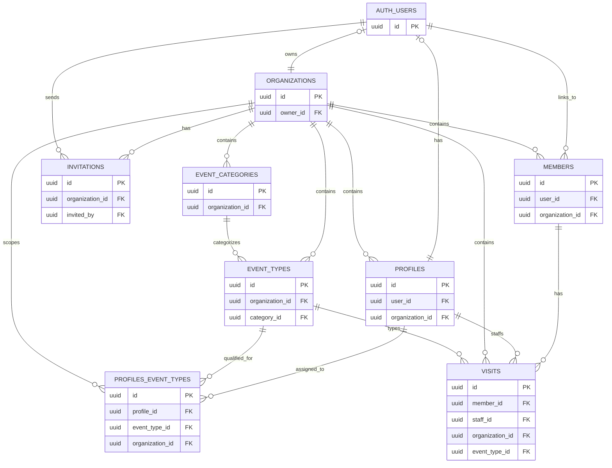

# Wellness Manage

A modern wellness management application built with Next.js, TypeScript, and Tailwind CSS.

## Tech Stack

- **Framework:** Next.js 16 (App Router)
- **Language:** TypeScript 5
- **Styling:** Tailwind CSS 4
- **Components:** shadcn/ui
- **Icons:** Lucide React
- **Authentication:** Supabase Auth
- **Linting:** ESLint 9
- **Package Manager:** pnpm
- **Node.js:** v22 (LTS)

## Project Structure

```
wellness-manage/
├── src/
│   ├── app/              # Next.js App Router pages and layouts
│   │   ├── api/          # API routes
│   │   ├── layout.tsx    # Root layout
│   │   └── page.tsx      # Home page
│   ├── components/       # Reusable React components
│   ├── hooks/            # Custom React hooks
│   ├── lib/              # Utility functions and helpers
│   │   ├── constants.ts  # App constants
│   │   └── utils.ts      # Utility functions
│   ├── types/            # TypeScript type definitions
│   └── styles/           # Additional styles (if needed)
├── public/               # Static assets
├── next.config.ts        # Next.js configuration
├── tsconfig.json         # TypeScript configuration
├── tailwind.config.ts    # Tailwind CSS configuration
└── package.json          # Dependencies and scripts
```

## Getting Started

### Prerequisites

- Node.js 22.x (LTS) - specified in `.nvmrc`
- pnpm 10.x or higher
- nvm (recommended for Node.js version management)

### Installation

1. Clone the repository
2. Use the correct Node.js version:

```bash
nvm use
```

3. Set up environment variables:

Create a `.env.local` file in the root directory:

```bash
NEXT_PUBLIC_SUPABASE_URL=your_supabase_project_url
NEXT_PUBLIC_SUPABASE_ANON_KEY=your_supabase_anon_key
```

See [SUPABASE_SETUP.md](./SUPABASE_SETUP.md) for detailed instructions.

4. Install dependencies:

```bash
pnpm install
```

5. Run the development server:

```bash
pnpm dev
```

6. Open [http://localhost:3000](http://localhost:3000) in your browser

## Available Scripts

- `pnpm dev` - Start development server
- `pnpm build` - Build for production
- `pnpm start` - Start production server
- `pnpm lint` - Run ESLint
- `pnpm lint:fix` - Auto-fix lint issues
- `pnpm type-check` - Check TypeScript types

## Features

- ✅ Next.js 16 with App Router
- ✅ TypeScript for type safety
- ✅ Tailwind CSS for styling
- ✅ shadcn/ui components (Button, Card, Badge, Input, Label)
- ✅ Lucide React icons
- ✅ Supabase authentication (email/password)
- ✅ Protected routes with middleware
- ✅ Login page and dashboard
- ✅ ESLint for code quality
- ✅ Custom hooks (useLocalStorage)
- ✅ Utility functions
- ✅ API routes ready
- ✅ Path aliases (@/_ for src/_)
- ✅ Node.js version pinned with .nvmrc

## Database Schema

The application uses Supabase (PostgreSQL) with the following entity relationships:



### Key Entities

- **AUTH_USERS**: Supabase authentication users
- **ORGANIZATIONS**: Wellness center organizations
- **PROFILES**: User profiles linked to organizations (staff members)
- **MEMBERS**: Clients/members of the wellness center
- **EVENT_CATEGORIES**: Service categories (e.g., Massage, Yoga, Therapy)
- **EVENT_TYPES**: Specific services/treatments offered
- **PROFILES_EVENT_TYPES**: Junction table linking profiles to services they can perform (many-to-many)
- **VISITS**: Appointments/visits scheduled for members
- **INVITATIONS**: Pending staff invitations to join organizations

## Development Guidelines

### Import Aliases

Use the `@/` alias to import from the src directory:

```typescript
import { User } from "@/types";

import { formatDate } from "@/lib/utils";
```

### File Organization

- **Components:** Place reusable UI components in `src/components/`
  - `src/components/ui/` - shadcn/ui components
- **Hooks:** Custom React hooks go in `src/hooks/`
- **Utils:** Helper functions in `src/lib/`
- **Types:** TypeScript types in `src/types/`
- **API Routes:** Backend endpoints in `src/app/api/`

### Using shadcn/ui Components

shadcn/ui components are installed in `src/components/ui/`. To add more components:

```bash
npx shadcn@latest add [component-name]
```

Example usage:

```typescript
import { Button } from "@/components/ui/button";
import { Card } from "@/components/ui/card";

export default function MyComponent() {
  return (
    <Card>
      <Button>Click me</Button>
    </Card>
  );
}
```

Available components:

- Button
- Card (with CardHeader, CardTitle, CardDescription, CardContent, CardFooter)
- Badge
- Input
- Label

Browse all components: [shadcn/ui](https://ui.shadcn.com/docs/components)

### Authentication with Supabase

The project uses Supabase for authentication. See [SUPABASE_SETUP.md](./SUPABASE_SETUP.md) for complete setup instructions.

**Quick Start:**

1. Create a Supabase project
2. Add credentials to `.env.local`
3. Create a test user in Supabase dashboard
4. Visit `/login` to sign in
5. Access `/dashboard` after authentication

**Protected Routes:**

- `/dashboard` - Requires authentication
- Middleware automatically redirects unauthenticated users to `/login`

**Sign Out:**

- Click "Sign Out" button on dashboard
- Or POST to `/auth/signout`

## Deployment

### Deploy to Vercel

The easiest way to deploy this Next.js app is using Vercel:

[](https://vercel.com/new/clone?repository-url=https://github.com/proginmind/wellness-manage)

**Quick Steps:**

1. Click the deploy button above or go to [vercel.com/new](https://vercel.com/new)
2. Import your GitHub repository
3. Add environment variables (see `.env.example`)
4. Click "Deploy"
5. Update Supabase redirect URLs with your Vercel domain

**Detailed Instructions:** See [DEPLOYMENT.md](./DEPLOYMENT.md) for complete deployment guide.

### Environment Variables for Production

Ensure these are set in Vercel:

```bash
NEXT_PUBLIC_SUPABASE_URL=your_production_supabase_url
NEXT_PUBLIC_SUPABASE_ANON_KEY=your_production_anon_key
NEXT_PUBLIC_APP_URL=https://your-app.vercel.app
```

### Post-Deployment

After deploying, update your Supabase project settings:

- Add Vercel URL to **Site URL**
- Add `https://your-app.vercel.app/**` to **Redirect URLs**

## Learn More

- [Next.js Documentation](https://nextjs.org/docs)
- [TypeScript Documentation](https://www.typescriptlang.org/docs)
- [Tailwind CSS Documentation](https://tailwindcss.com/docs)
- [Vercel Deployment Docs](https://vercel.com/docs)
- [Supabase Documentation](https://supabase.com/docs)

## License

MIT
